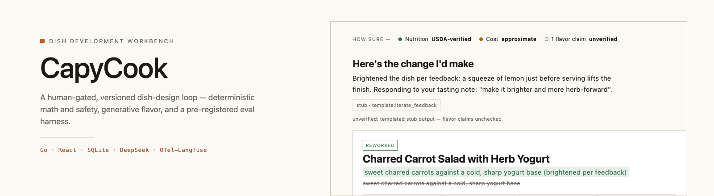
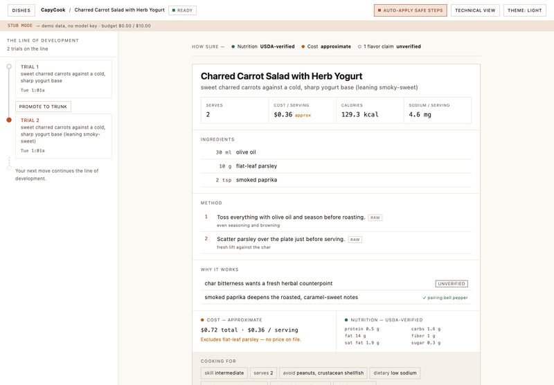
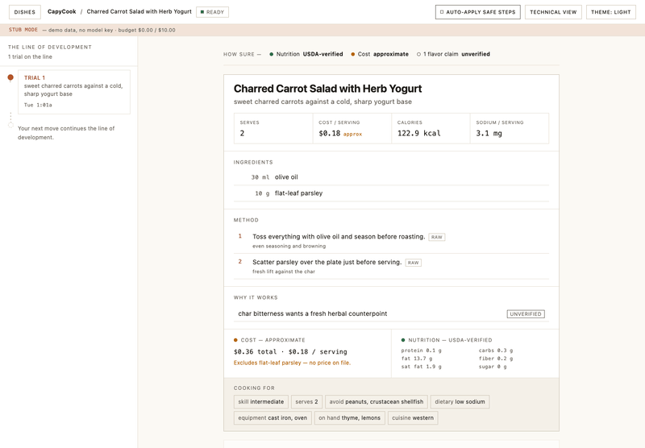
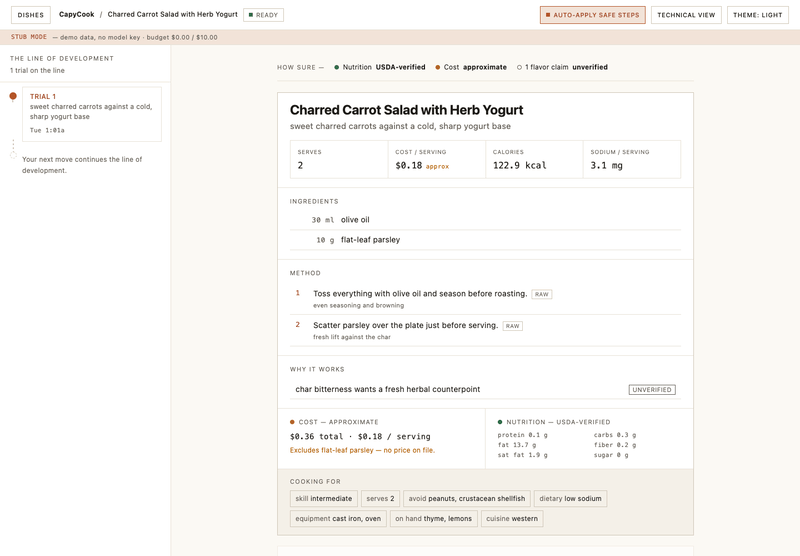
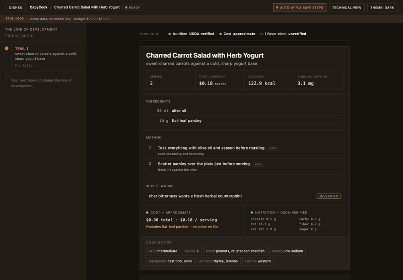
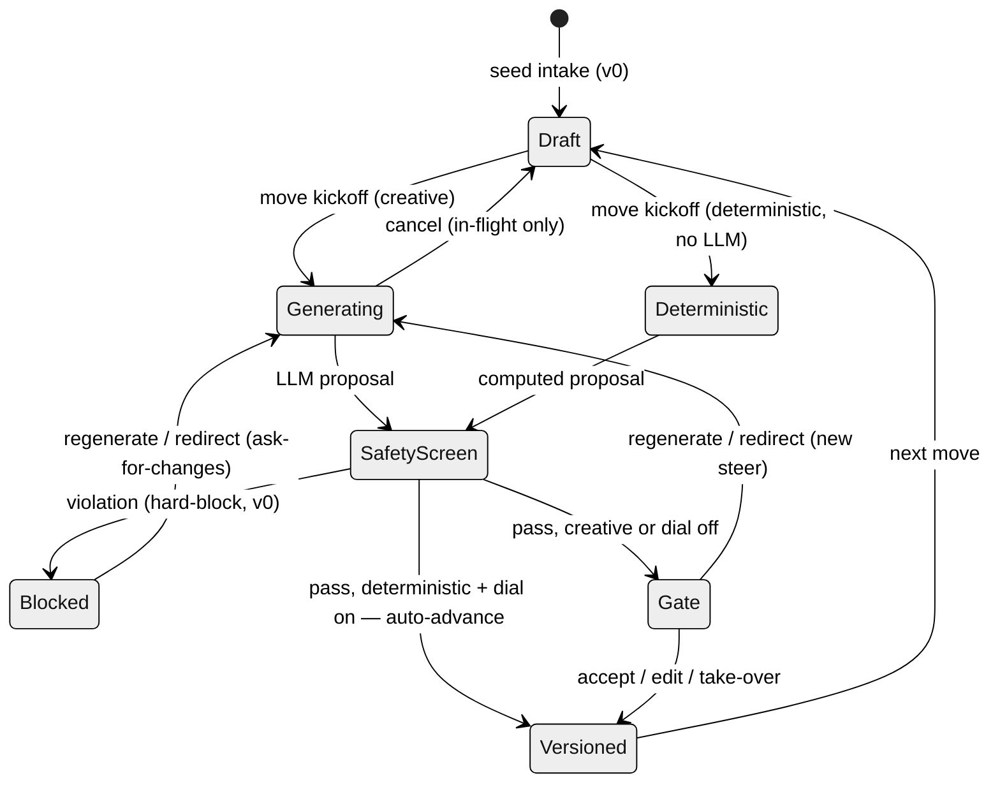
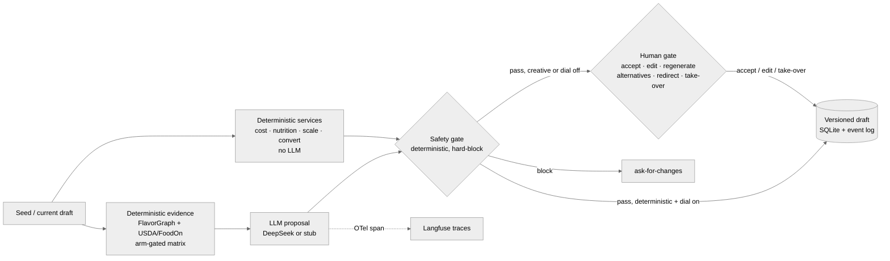
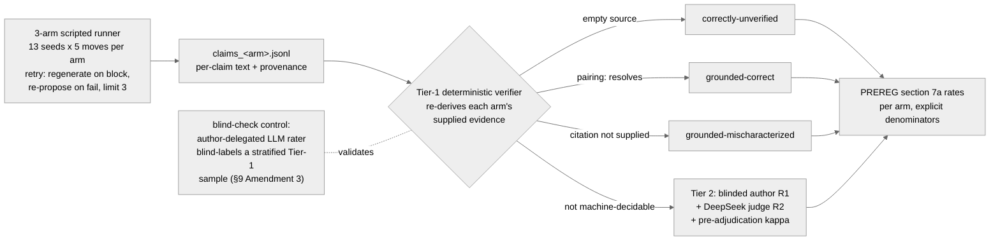
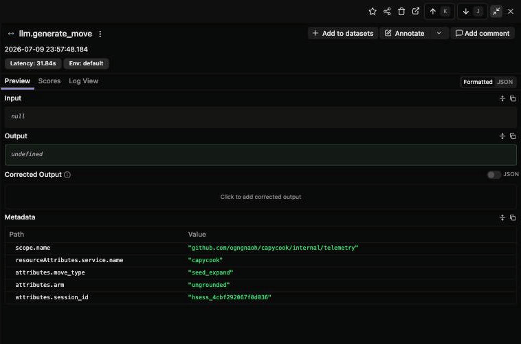

# CapyCook — Dish Development Workbench

<!-- badges resolve after first push (D7: publish gate) -->
[](https://github.com/ogngnaoh/capycook/actions/workflows/ci.yml)

[](LICENSE)



Go 1.26 stdlib backend · React/Vite/Tailwind workbench · SQLite · swappable LLM edge (DeepSeek or deterministic stub) · OTel→Langfuse tracing · hand-rolled pre-registered eval harness.

> **Status:** built & demoable (keyless stub mode); live eval campaign complete (2026-07-10, 562 claims across 3 arms — [Results](#results)) — methodology pre-registered & frozen before any data ([docs/PREREGISTRATION.md](docs/PREREGISTRATION.md), 2026-07-01).

**CapyCook** is an open-source, self-hostable **human-in-the-loop workbench** for cooks
who want to *develop and understand their own dishes*, not just fetch or generate a recipe.
Unlike a chatbot that hands you a finished recipe, it runs a **back-and-forth co-development
loop**: a hand-rolled, interruptible state machine proposes one dish *move* at a time, builds
and scales the dish with **deterministic nutrition you can trust (USDA FoodData Central)** and
a **clearly-approximate cost estimate** (never the model's arithmetic), runs every proposal
through a **deterministic food-safety gate that can block it**, and keeps a **versioned,
branchable draft** so you can iterate against the exact version you cooked. **The agent
proposes; you dispose — at every move.**

## Demo

Eight short captures (5–11s each) of the real loop, driven headlessly in stub-LLM mode
(no API key) against a fresh database. Capture tooling lives in [`web/tools/`](web/tools/).

**1 · Seed → proposal → accept → the trial record.** A plain-language seed becomes a proposed
recipe at the pass — deterministic nutrition, USDA `fdc:` / FoodOn `foodon:` provenance chips
on every ingredient, cost shown as an explicit estimate, and any model flavor claim marked
`[unverified]`. You accept, and it lands as **Trial 1** in a versioned record.


**2 · The deterministic safety gate blocks a dangerous move — and the loop recovers.** Steering
toward a room-temperature garlic-in-oil infusion trips the anaerobic-garlic-oil critical-limit
rule; the move is **held**, with the offending step shown and the rule anchored to it. *Ask for
changes* redirects the kitchen toward a lemon-herb pan sauce and the loop recovers into **Trial 2**.


**3 · Kill the server mid-session; nothing is lost.** When the backend drops, the live stream
shows a quiet *"Reconnecting — your draft is safe"* banner. Restart the server and the stream
re-syncs on its own; a **deep-link reload** then rebuilds the exact dish, draft, and trial
history from SQLite. State is persisted, not in-memory.


**4 · Cook it, then iterate against what you actually made.** *I cooked this* opens tasting
notes on the current trial; the notes feed a **post-cook rework** proposal that loops back
through the gate for your approval — closing the develop → cook → iterate cycle.


**5 · Promote a past trial and develop off it — the line branches.** Any earlier trial opens as
a read-only snapshot; **Promote to trunk** makes it the version in service, and the next
accepted move develops off *it* — the timeline now shows two lines sharing Trial 1, and the
new trial wears a **Branch** badge.



**6 · The autonomy dial: safe math fast-forwards, creative moves still gate.** With *Auto-apply
safe steps* on, a deterministic move (recompute cost) lands as a trial with **no gate** — a
toast confirms it was applied automatically. A creative move right after still parks at
*Needs your call*. Autonomy extends exactly as far as determinism does.



**7 · Stop an in-flight move mid-stream.** While the kitchen is *Working on your idea*, **Stop**
aborts the move — nothing is stored, the bench returns to Ready, and a second try left alone
runs through to the gate. (The stub normally answers in microseconds, so this capture runs it
with an artificial 3-second latency; the cancel path itself is the production code.)



**8 · Technical view, dark theme.** The same workbench with the plumbing surfaced: USDA `fdc:` /
FoodOn `foodon:` ids on every ingredient, full version hashes in the timeline, and the raw
`unverified` field slugs under the nutrition panel.



## Architecture

### The move/gate loop (the core state machine)



### System data-flow (one grounded move)



The gate's live verb set is six (`accept · edit · regenerate · alternatives · redirect ·
take_over`); PREREGISTRATION's frozen-five reporting taxonomy (`accept/edit/regenerate/
reject/redirect`) is a stated eval roll-up, not a literal gate action — `reject` there maps
to cancelling a move before it ever reaches the gate (see `internal/eval/mapping.go`). One
simplification: a blocked or gate-pending *deterministic* move re-enters the deterministic
path on regenerate/redirect — the state diagram draws only the creative re-launch.

### The eval pipeline (tiered verification)



*On the live campaign (2026-07-10) Tier-1 decided 562/562 claims — the Tier-2 path
(R1 sheet, judge, κ) had zero rows, machine-confirmed, and the blind-check control
— run by an author-delegated LLM rater (§9 Amendment 3) — is the only labeling outside
the deterministic verifier.*

## How it works

- **A hand-rolled move/gate state machine, not `prompt → response`.** Each turn is a *move*
  (propose · edit · redirect · regenerate · take-over) that produces a batch **Proposal** and
  pauses at a two-level **gate** for your decision. Nothing auto-applies unless you turn on the
  minimal autonomy dial, which only fast-forwards *deterministic* moves.
- **A strict deterministic/generative boundary.** The model writes prose and suggests moves;
  it never computes a number you're asked to trust. Nutrition comes from USDA FoodData Central,
  identity from FoodOn/USDA entity resolution, and cost from a static, explicitly-approximate
  table. Every ingredient carries its provenance; unverifiable model claims are labeled.
- **A deterministic safety gate (hard block).** A narrow set of rules — an anaerobic-preservation
  blocklist (e.g. room-temperature garlic-in-oil), minimum cook temperatures, and an allergen
  check against your stated constraints — can *refuse* a proposal outright, with the triggering
  rule anchored to the offending step. See the disclaimer below.
- **A versioned, branchable draft.** Accepted moves snapshot into a git-style trial chain you
  can revisit, promote, and branch from — so "iterate against the exact version I cooked" is a
  first-class operation, not a memory of a chat.
- **Single-process streaming with cancel, and durable state.** Proposals stream over one
  per-dish EventSource with a separate cancel path; dishes and trials persist to SQLite, so a
  crash or restart loses nothing (demo 3).

**The flagship is the engineering and the evaluation methodology, not a grounding number.** The
headline metrics are *process* quality — claim-provenance/hallucination rate and the
accept/edit/reject dynamics of the gate — which hold their meaning whatever the model does. As a
supporting, openly-hedged experiment, the eval asks whether grounding a model in a (contested,
2011-lineage, Western-cuisine) flavor-pairing signal actually beats just asking a strong 2026
LLM — and reports the real answer, including a null.

### Where to sample the code

| Package | What it is |
|---|---|
| `internal/orchestrator` | the move/gate state machine — proposals, safety screen, versioning |
| `internal/eval` | pre-registered eval harness: 3-arm runner, tiered labeling kit (Tier-1 verifier + blinded R1 + judge R2), κ, rates |
| `internal/llm` | swappable model edge: DeepSeek client, deterministic stub, prompt pack |
| `internal/grounding` | FlavorGraph pairing + USDA/FoodOn entity resolution |
| `internal/services` | deterministic side: nutrition/cost recompute, allergen + safety gate |
| `internal/store` / `internal/eventlog` | SQLite persistence · append-only event log (H2 telemetry) |
| `internal/httpapi` / `internal/transport` | HTTP API + SSE stream to the workbench |
| `internal/draft` / `internal/proposal` | dish-draft model + proposal/citation wire types |
| `internal/telemetry` / `internal/config` | OTel→Langfuse seam · env config |

`cmd/eval` is the harness CLI over `internal/eval`: `run` (scripted 3-arm runner), `replay`
(H2 gate-dynamics report), `rates` (§7a rates), `kappa` (Cohen's κ + confusion matrix), and
`report` (paste-ready markdown + JSON) subcommands. `web/` is the React/Vite/Tailwind
workbench frontend — the timeline-spine, dish-stage, intent-bar, gate-as-decision UI that
renders the SSE stream and drives moves through the gate.

## Methodology

The evaluation is governed by the **frozen pre-registration**,
[`docs/PREREGISTRATION.md`](docs/PREREGISTRATION.md) (registered 2026-07-01, before
any eval run; changes only via its dated §9 amendment log). That document is the
source of truth — this section summarizes it and restates nothing.

- **Three arms**, same orchestrator and harness, only the grounding toggle differs:
  **ungrounded** (a modern 2026 LLM, no retrieval) · **FlavorGraph-only** (the
  contested flavor-pairing signal alone) · **grounded** (FlavorGraph + deterministic
  USDA/FoodOn resolution). The middle arm is what makes a null interpretable: it
  separates the flavor signal from the deterministic path.
- **H1 — provenance & hallucination** *(primary)*: the grounded arm is predicted to
  show higher claim-provenance and lower hallucination than ungrounded — with the
  pre-committed caveat that most of any gap belongs to the deterministic
  USDA/entity-resolution path, not the flavor-pairing signal.
- **H2 — gate dynamics** *(secondary)*: deterministic moves mostly accepted;
  creative moves draw proportionally more edits and redirects. **Single-operator
  caveat:** one human (the author) generates every gate decision, so this is
  autobiographical-design telemetry — always with an explicit N, never a bare %.
- **H3 — grounding ablation** *(supporting, openly hedged)*: grounding plausibly
  helps correctness (chiefly via the deterministic path); on creativity/quality a
  modest-or-null effect is predicted.
- **Pre-committed null interpretation:** a null on the creativity/quality ablation
  is scored as a *confirmed prediction* (the pairing hypothesis is contested and v0
  is Western-only), not a failure — and a correctness win driven by the
  deterministic path is never reported as a flavor-grounding win.
- **Reliability plan (as amended):** PREREG §9 Amendment 1 replaced the second human
  labeler with tiered verification — a deterministic Tier-1 verifier (machine labels,
  validated by a blind-check control), plus a blinded author R1 pass and a DeepSeek
  judge R2 with pre-adjudication Cohen's κ over all Tier-2 claims. Amendment 2 added
  bounded move retries to the harness runner after live-model variance made the
  all-or-nothing arm design infeasible. Amendment 3 records that the blind-check pass
  was executed by an author-delegated LLM rater — its agreement figure is
  model-validates-machine, never human validation (full text + rationale for all three
  in [docs/PREREGISTRATION.md §9](docs/PREREGISTRATION.md)).

Every `llm.generate_move` call in the campaign shipped exactly one OTel span to
Langfuse — session id, arm, and move type ride the span so H2 telemetry can be
cross-checked against the trace stream; span payloads stay attribute-only by design
(prompts and drafts never ride the telemetry). One span from the live campaign:



## Results

The grounded arm of the campaign, as it ran — real log, real commands (budget banner,
live-model + telemetry pins, then the arm summary with its skip reported, not silenced):


Live 3-arm campaign, 2026-07-10 (13 ratified seeds × 5 moves × 3 arms, deepseek-v4-pro,
instruments frozen at PREREG §9's T1 re-pin; total model spend $0.87). Seeds completed:
**12/13 in every arm** — bench-12 (the tree-nuts stress seed) was blocked by the
deterministic allergen gate on all four generation attempts (one initial + three
Amendment-2 retries) in all three arms
(`allergen-unresolved`; Amendment-2 skip, reported not silent).

### Provenance rates — PREREG §7a (per arm, checkable denominator)

| arm | claims | checkable | provenance | mischaracterization | hallucination |
|---|---|---|---|---|---|
| ungrounded | 150 | 150 | 1.000 | 0.000 | 0.000 |
| flavorgraph | 203 | 203 | 1.000 | 0.000 | 0.000 |
| grounded | 209 | 209 | 1.000 | 0.000 | 0.000 |

Label composition (the contrast the headline rates flatten): ungrounded emitted **zero
citations** (150× correctly-unverified); flavorgraph and grounded each emitted **10
`pairing:` citations, all resolving against their arm's supplied evidence**
(grounded-correct), the rest correctly-unverified. No claim in any arm fabricated or
mangled a citation.

### Labeling reliability

Tier-1 (deterministic verifier) decided **562/562 claims — the Tier-2 path had zero
rows**, so the pre-registered κ/confusion-matrix machinery had nothing to measure
(reported per §8: the frozen design met an unexpected data shape; nothing is imputed).
The blind-check control — an 18-row stratified Tier-1 sample blind-labeled by an
author-delegated LLM rater (fresh-context Claude agent, §9 Amendment 3;
model-validates-machine, cross-family vs the DeepSeek generator/judge) — agreed with
the verifier on **15/18 (83%)**. All three divergences were subjective flavor-harmony
claims the rater judged `opinion-non-checkable` where the mechanical empty-source rule
says `correctly-unverified` — the residual-risk shape Amendment 1's control watches
for, surfaced here as signal rather than error.

### Gate dynamics — H2

*Gate-dynamics telemetry is accumulating (single operator); this subsection is filled
from `eval replay` — explicit N, single-operator caveat — before publish (S8; Task 5,
resequenced).*

### Findings

The three §7a rates land at ceiling (1.000 / 0.000 / 0.000) in every arm: the live model
never fabricated a citation, and every uncited claim was correctly rendered
`[unverified]`. Rendered against the registration, **H1 is null on the registered
contrast** — grounded showed no provenance or hallucination advantage over ungrounded —
and the null is a ceiling effect, not a quality result: the ungrounded arm never
*attempted* a citation, so there was no fabrication for grounding to prevent, and §8's
deterministic-path-first attribution rule goes unused (there is no gap to attribute).
Nor does the ceiling show the arms are equally good: it shows the registered instrument
(provenance rates over the checkable denominator) cannot separate arms when citation
uptake is 0–5%. The arms instead separate on **citation uptake**, which was low
everywhere (10/209 grounded, 10/203 flavorgraph, 0/150 ungrounded): grounding evidence
changed *whether* the model cites (ungrounded cited nothing; both evidence-fed arms
cited, always correctly) but not how often it grounds a claim. Tier-1's 100% coverage —
a consequence of provenance vocabulary staying within `pairing:`/empty — collapsed the
planned human-labeling campaign to the 18-row control. These are descriptive results
over one model, one seed set, and a single-operator telemetry stream; they are not
user-research or quality claims (§8).

## Quickstart (fork & run)

Prerequisites: Go 1.26+, Node 22+ (frontend build only), `make`.

```sh
git clone https://github.com/ogngnaoh/capycook.git
cd capycook
cp .env.example .env   # every value optional — missing secrets warn, never fail
make build-all         # web (npm ci + vite build) + Go server -> bin/capycook
make run               # workbench + GET /healthz on :8080
```

- **Stub mode works keyless.** With no `DEEPSEEK_API_KEY` set, the server runs a deterministic
  stub LLM and the workbench shows a visible "stub mode — no model key" banner; the full
  loop — proposals, the safety gate, versioning, persistence — still works (this is the mode
  every demo GIF above was captured in). Set `DEEPSEEK_API_KEY` to go live.
- `make build` alone compiles the backend (API + `/healthz`) without Node; the embedded
  workbench UI needs `make build-all`.
- **Docker:** `docker compose up` runs the full fork kit (app + volume; keyless
  stub mode). `make docker-build` builds just the backend image (`capycook:dev`).
  Full walkthrough + the opt-in self-hosted Langfuse profile: [DEPLOY.md](DEPLOY.md).

## Related work & positioning

The consumer cooking-app market optimizes to *remove thinking* — find, generate, plan, and
organize recipes for the convenience cook. The serious hobbyist who wants to *develop their own
dishes and understand why they work* has the opposite job and is not served by that market. The
honest, narrow claim (from a five-product landscape scan, DESIGN §3): **not found — no tool
offers grounded, structured, iterative dish-development with deterministic correctness and a
versioned co-development loop.**

What separates CapyCook from a recipe generator is **not** better prose — it's that the value
lives in the parts that *aren't* the LLM: the human gate, the deterministic/generative boundary
with per-claim provenance, the deterministic safety block, the versioned draft, and a
**pre-registered, reproducible eval**. Remove the model and there's still an engineered system
behind it. The counter-case is stated plainly: for a one-shot question with no need to resume or
lean on a guaranteed number, raw ChatGPT is already good enough — the workbench's edge only
appears at the second and third iteration.

Prior art the design situates against: IBM Chef Watson; FoodPuzzle (KDD'25); FoodSky
(Patterns'25); Magentic-UI (arXiv 2507.22358) for the human-in-the-loop interaction model; and
the ChatGPT-plus-companions default that is the real incumbent. Full treatment in
[`DESIGN.md`](DESIGN.md) §3.

## Safety

**The safety gate is an engineering guardrail, not food-safety advice.** It is a *narrow,
deliberately incomplete* deterministic check — an anaerobic-preservation blocklist, minimum
cook-temperature floors, and an allergen match against the constraints you enter. It exists to
demonstrate domain-hazard modeling and to stop a few well-known hazardous patterns; it does **not**
certify a dish as safe, and absence of a block does **not** mean a recipe is safe to cook or eat.
Allergen handling depends on the constraints you provide and on correct ingredient identity, and
cannot account for cross-contamination or trace ingredients. **Always apply your own judgment and
standard food-safety practice — verify temperatures, storage, and allergens before serving.** See
DESIGN §8.7 for the gate's scope and its documented limits.

## Self-hosting & telemetry (honesty note)

CapyCook is designed to run entirely on your own machine with **no external calls beyond the LLM
you configure**:

- **LLM:** DeepSeek-V4-Pro via an OpenAI-compatible endpoint when `DEEPSEEK_API_KEY` is set;
  otherwise the local deterministic stub. This is the only outbound dependency of the core loop.
- **Tracing is optional and off by default.** OpenTelemetry export to Langfuse activates *only*
  when `LANGFUSE_PUBLIC_KEY` / `LANGFUSE_SECRET_KEY` / `LANGFUSE_HOST` are all set; with them
  unset the tracer is a no-op (the server logs this at startup) and nothing leaves the box. You
  can point `LANGFUSE_HOST` at a self-hosted Langfuse — the shipped compose profile runs it locally (`docker compose --profile langfuse up` — see [DEPLOY.md](DEPLOY.md)).
- **Data:** dishes and trials live in a local SQLite file (`DB_PATH`); the vendored FlavorGraph /
  USDA / FoodOn subsets under `data/` are read-only. There is no analytics, account system, or
  phone-home.

## Documents

- [`DESIGN.md`](DESIGN.md) — product + system design (what/why, v0.4)
- [`docs/SPEC.md`](docs/SPEC.md) — the Go/React stack (how)
- [`docs/PREREGISTRATION.md`](docs/PREREGISTRATION.md) — **frozen** eval methodology
- [`docs/milestones.md`](docs/milestones.md) — execution order
- [`DEPLOY.md`](DEPLOY.md) — fork kit: docker compose walkthrough, platform notes, self-hosted Langfuse wiring.
- [`web/tools/`](web/tools/) — headless capture tooling for the evidence stills and demo GIFs

## License

MIT (see [LICENSE](LICENSE)). Vendored data assets carry their own licenses and
provenance under `data/` (USDA FDC: CC0 · FoodOn: CC BY 4.0 · FlavorGraph: Apache-2.0).
