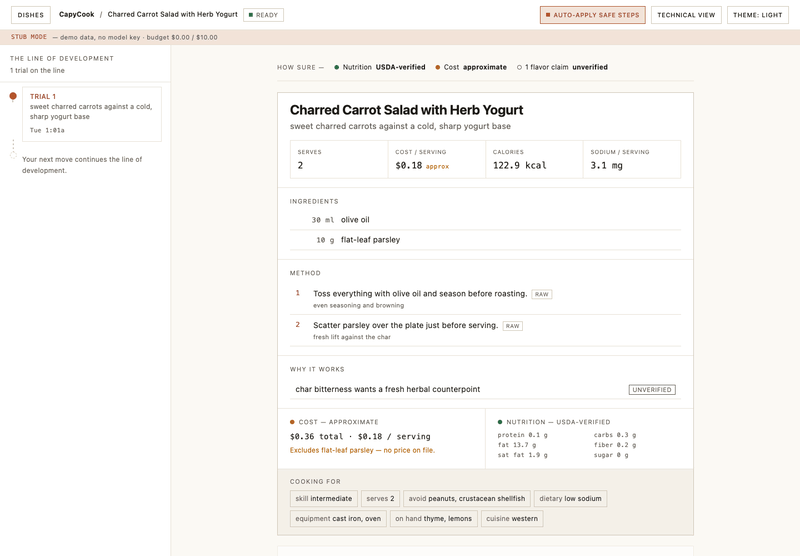
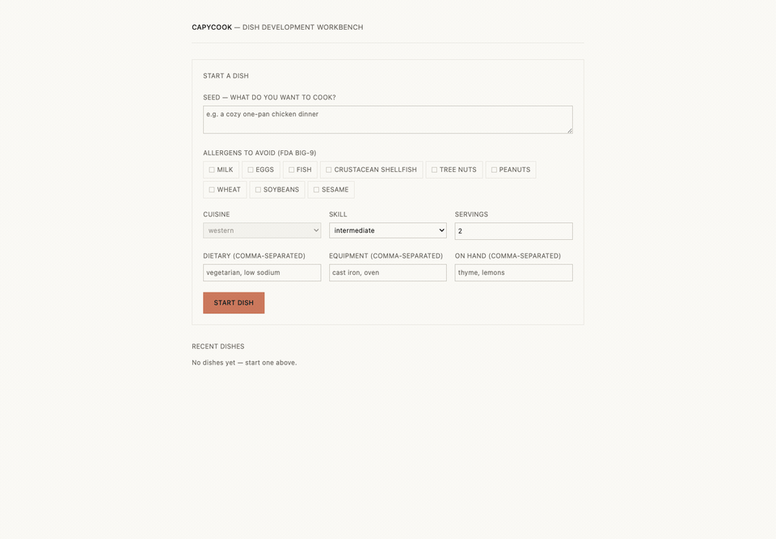

# CapyCook — Dish Development Workbench

> **Status (2026-07-07): mid-build — zero eval data exists.** The workbench and the
> full human-gated loop are built and demoable (stub-LLM mode runs keyless); the eval
> methodology is pre-registered and frozen ([`docs/PREREGISTRATION.md`](docs/PREREGISTRATION.md),
> registered 2026-07-01 — zero eval data existed at registration). The [Results](#results)
> section below is **structure only** — it fills when the human-led measurement campaign
> (milestone 02) completes. The pre-registration document satisfies the "register the
> methodology and hypothesis before any run" requirement (DESIGN §15 v0); this note records
> that substitution explicitly.

**CapyCook** is an open-source, self-hostable **human-in-the-loop workbench** for cooks
who want to *develop and understand their own dishes*, not just fetch or generate a recipe.
Unlike a chatbot that hands you a finished recipe, it runs a **back-and-forth co-development
loop**: a hand-rolled, interruptible state machine proposes one dish *move* at a time, builds
and scales the dish with **deterministic nutrition you can trust (USDA FoodData Central)** and
a **clearly-approximate cost estimate** (never the model's arithmetic), runs every proposal
through a **deterministic food-safety gate that can block it**, and keeps a **versioned,
branchable draft** so you can iterate against the exact version you cooked. **The agent
proposes; you dispose — at every move.**

## Demo

Four ~10-second captures of the real loop, driven headlessly in stub-LLM mode (no API key)
against a fresh database. Capture tooling lives in [`web/tools/`](web/tools/).

**1 · Seed → proposal → accept → the trial record.** A plain-language seed becomes a proposed
recipe at the pass — deterministic nutrition, USDA `fdc:` / FoodOn `foodon:` provenance chips
on every ingredient, cost shown as an explicit estimate, and any model flavor claim marked
`[unverified]`. You accept, and it lands as **Trial 1** in a versioned record.


**2 · The deterministic safety gate blocks a dangerous move — and the loop recovers.** Steering
toward a room-temperature garlic-in-oil infusion trips the anaerobic-garlic-oil critical-limit
rule; the move is **held**, with the offending step shown and the rule anchored to it. *Ask for
changes* redirects the kitchen toward a lemon-herb pan sauce and the loop recovers into **Trial 2**.



**3 · Kill the server mid-session; nothing is lost.** When the backend drops, the live stream
shows a quiet *"Reconnecting — your draft is safe"* banner. Restart the server and the stream
re-syncs on its own; a **deep-link reload** then rebuilds the exact dish, draft, and trial
history from SQLite. State is persisted, not in-memory.



**4 · Cook it, then iterate against what you actually made.** *I cooked this* opens tasting
notes on the current trial; the notes feed a **post-cook rework** proposal that loops back
through the gate for your approval — closing the develop → cook → iterate cycle.


## How it works

- **A hand-rolled move/gate state machine, not `prompt → response`.** Each turn is a *move*
  (propose · edit · redirect · regenerate · take-over) that produces a batch **Proposal** and
  pauses at a two-level **gate** for your decision. Nothing auto-applies unless you turn on the
  minimal autonomy dial, which only fast-forwards *deterministic* moves.
- **A strict deterministic/generative boundary.** The model writes prose and suggests moves;
  it never computes a number you're asked to trust. Nutrition comes from USDA FoodData Central,
  identity from FoodOn/USDA entity resolution, and cost from a static, explicitly-approximate
  table. Every ingredient carries its provenance; unverifiable model claims are labeled.
- **A deterministic safety gate (hard block).** A narrow set of rules — an anaerobic-preservation
  blocklist (e.g. room-temperature garlic-in-oil), minimum cook temperatures, and an allergen
  check against your stated constraints — can *refuse* a proposal outright, with the triggering
  rule anchored to the offending step. See the disclaimer below.
- **A versioned, branchable draft.** Accepted moves snapshot into a git-style trial chain you
  can revisit, promote, and branch from — so "iterate against the exact version I cooked" is a
  first-class operation, not a memory of a chat.
- **Single-process streaming with cancel, and durable state.** Proposals stream over one
  per-dish EventSource with a separate cancel path; dishes and trials persist to SQLite, so a
  crash or restart loses nothing (demo 3).

**The flagship is the engineering and the evaluation methodology, not a grounding number.** The
headline metrics are *process* quality — claim-provenance/hallucination rate and the
accept/edit/reject dynamics of the gate — which hold their meaning whatever the model does. As a
supporting, openly-hedged experiment, the eval asks whether grounding a model in a (contested,
2011-lineage, Western-cuisine) flavor-pairing signal actually beats just asking a strong 2026
LLM — and reports the real answer, including a null.

## Methodology

The evaluation is governed by the **frozen pre-registration**,
[`docs/PREREGISTRATION.md`](docs/PREREGISTRATION.md) (registered 2026-07-01, before
any eval run; changes only via its dated §9 amendment log). That document is the
source of truth — this section summarizes it and restates nothing.

- **Three arms**, same orchestrator and harness, only the grounding toggle differs:
  **ungrounded** (a modern 2026 LLM, no retrieval) · **FlavorGraph-only** (the
  contested flavor-pairing signal alone) · **grounded** (FlavorGraph + deterministic
  USDA/FoodOn resolution). The middle arm is what makes a null interpretable: it
  separates the flavor signal from the deterministic path.
- **H1 — provenance & hallucination** *(primary)*: the grounded arm is predicted to
  show higher claim-provenance and lower hallucination than ungrounded — with the
  pre-committed caveat that most of any gap belongs to the deterministic
  USDA/entity-resolution path, not the flavor-pairing signal.
- **H2 — gate dynamics** *(secondary)*: deterministic moves mostly accepted;
  creative moves draw proportionally more edits and redirects. **Single-operator
  caveat:** one human (the author) generates every gate decision, so this is
  autobiographical-design telemetry — always with an explicit N, never a bare %.
- **H3 — grounding ablation** *(supporting, openly hedged)*: grounding plausibly
  helps correctness (chiefly via the deterministic path); on creativity/quality a
  modest-or-null effect is predicted.
- **Pre-committed null interpretation:** a null on the creativity/quality ablation
  is scored as a *confirmed prediction* (the pairing hypothesis is contested and v0
  is Western-only), not a failure — and a correctness win driven by the
  deterministic path is never reported as a flavor-grounding win.
- **Reliability (κ) plan:** a second labeler double-labels 15–20% of the ~200-claim
  set; Cohen's κ + a confusion matrix are reported; κ < 0.4 flags the rubric as
  ambiguous and the provenance/hallucination numbers as unreliable.

## Results

> **No eval data yet — results land in milestone 02 after the human-led measurement
> campaign.** The table below is structure only. Per PREREGISTRATION §7a the three
> rates are computed over the checkable denominator; `grounded-mischaracterized`
> counts neither for nor against.

| Arm | Provenance/honesty rate | Mischaracterization rate | Hallucination rate |
|---|---|---|---|
| Ungrounded | — | — | — |
| FlavorGraph-only | — | — | — |
| Grounded | — | — | — |
| Gate dynamics (accept/edit/regenerate/reject/redirect; single-operator telemetry, explicit N) | — | — | — |

## Quickstart (fork & run)

Prerequisites: Go 1.26+, Node 20+ (frontend build only), `make`.

```sh
git clone https://github.com/ogngnaoh/capycook.git
cd capycook
cp .env.example .env   # every value optional — missing secrets warn, never fail
make build-all         # web (npm ci + vite build) + Go server -> bin/capycook
make run               # workbench + GET /healthz on :8080
```

- **Stub mode works keyless.** With no `DEEPSEEK_API_KEY` set, the server runs a deterministic
  stub LLM and the workbench shows a visible "stub mode — no model key" banner; the full
  loop — proposals, the safety gate, versioning, persistence — still works (this is the mode
  every demo GIF above was captured in). Set `DEEPSEEK_API_KEY` to go live.
- `make build` alone compiles the backend (API + `/healthz`) without Node; the embedded
  workbench UI needs `make build-all`.
- **Docker:** `make docker-build` builds the backend image (`capycook:dev`). A
  `docker-compose.yml` fork kit (app + volume, optional self-hosted Langfuse profile)
  arrives in Phase 6.

## Related work & positioning

The consumer cooking-app market optimizes to *remove thinking* — find, generate, plan, and
organize recipes for the convenience cook. The serious hobbyist who wants to *develop their own
dishes and understand why they work* has the opposite job and is not served by that market. The
honest, narrow claim (from a five-product landscape scan, DESIGN §3): **not found — no tool
offers grounded, structured, iterative dish-development with deterministic correctness and a
versioned co-development loop.**

What separates CapyCook from a recipe generator is **not** better prose — it's that the value
lives in the parts that *aren't* the LLM: the human gate, the deterministic/generative boundary
with per-claim provenance, the deterministic safety block, the versioned draft, and a
**pre-registered, reproducible eval**. Remove the model and there's still an engineered system
behind it. The counter-case is stated plainly: for a one-shot question with no need to resume or
lean on a guaranteed number, raw ChatGPT is already good enough — the workbench's edge only
appears at the second and third iteration.

Prior art the design situates against: IBM Chef Watson; FoodPuzzle (KDD'25); FoodSky
(Patterns'25); Magentic-UI (arXiv 2507.22358) for the human-in-the-loop interaction model; and
the ChatGPT-plus-companions default that is the real incumbent. Full treatment in
[`DESIGN.md`](DESIGN.md) §3.

## Self-hosting & telemetry (honesty note)

CapyCook is designed to run entirely on your own machine with **no external calls beyond the LLM
you configure**:

- **LLM:** DeepSeek-V4-Pro via an OpenAI-compatible endpoint when `DEEPSEEK_API_KEY` is set;
  otherwise the local deterministic stub. This is the only outbound dependency of the core loop.
- **Tracing is optional and off by default.** OpenTelemetry export to Langfuse activates *only*
  when `LANGFUSE_PUBLIC_KEY` / `LANGFUSE_SECRET_KEY` / `LANGFUSE_HOST` are all set; with them
  unset the tracer is a no-op (the server logs this at startup) and nothing leaves the box. You
  can point `LANGFUSE_HOST` at a self-hosted Langfuse — a compose profile for it ships in Phase 6.
- **Data:** dishes and trials live in a local SQLite file (`DB_PATH`); the vendored FlavorGraph /
  USDA / FoodOn subsets under `data/` are read-only. There is no analytics, account system, or
  phone-home.

## Safety

**The safety gate is an engineering guardrail, not food-safety advice.** It is a *narrow,
deliberately incomplete* deterministic check — an anaerobic-preservation blocklist, minimum
cook-temperature floors, and an allergen match against the constraints you enter. It exists to
demonstrate domain-hazard modeling and to stop a few well-known hazardous patterns; it does **not**
certify a dish as safe, and absence of a block does **not** mean a recipe is safe to cook or eat.
Allergen handling depends on the constraints you provide and on correct ingredient identity, and
cannot account for cross-contamination or trace ingredients. **Always apply your own judgment and
standard food-safety practice — verify temperatures, storage, and allergens before serving.** See
DESIGN §8.7 for the gate's scope and its documented limits.

## Documents

- [`DESIGN.md`](DESIGN.md) — product + system design (what/why, v0.4)
- [`docs/SPEC.md`](docs/SPEC.md) — the Go/React stack (how)
- [`docs/PREREGISTRATION.md`](docs/PREREGISTRATION.md) — **frozen** eval methodology
- [`docs/milestones.md`](docs/milestones.md) — execution order
- [`web/tools/`](web/tools/) — headless capture tooling for the evidence stills and demo GIFs

## License

MIT (see [LICENSE](LICENSE)). Vendored data assets carry their own licenses and
provenance under `data/` (USDA FDC: CC0 · FoodOn: CC BY 4.0 · FlavorGraph: Apache-2.0).
