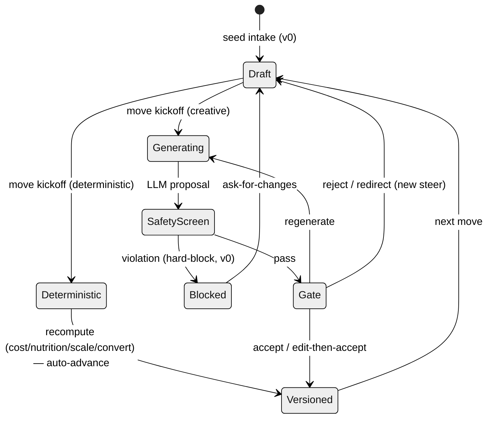
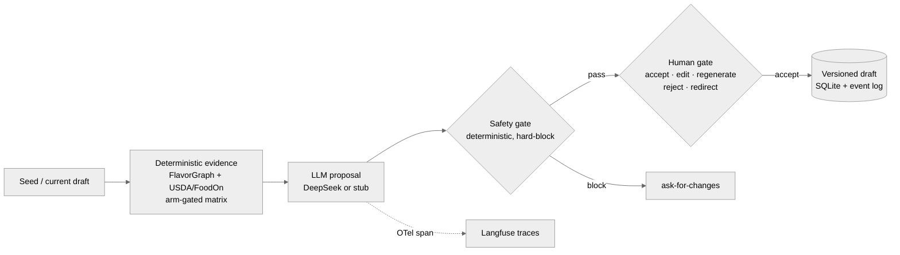

> **HISTORICAL / SUPERSEDED (2026-07-14):** Slices S1–S4 are complete; the body below
> is retained as their historical record and is no longer operational authority.
> Current work is governed by the [July 14 S8 release plan](2026-07-14-milestone-02-s8-showcase-release.md).

# Milestone 02 (measure-run) S1–S4 Implementation Plan

> **For agentic workers:** REQUIRED SUB-SKILL: Use superpowers:subagent-driven-development (recommended) or superpowers:executing-plans to implement this plan task-by-task. Steps use checkbox (`- [ ]`) syntax for tracking.

**Goal:** Execute slices S1–S4 of the milestone-02 reframe (spec: `docs/superpowers/specs/2026-07-08-milestone-02-reframe-and-showcase-design.md`): README surgery + repo hygiene + archive reorg + 2 Mermaid diagrams (S1); prereg §9 labeling amendment + milestone docs (S2); Tier-1 deterministic verifier (S3); blinded label kit + LLM judge R2 client (S4) — ending at the T1 instrument-pin user gate, ready for the S5 live run.

**Architecture:** The Tier-1 verifier re-derives ground truth per claim by rebuilding the exact evidence the arm supplied for the move that produced it (`llm.BuildEvidence` — a T1-pinned instrument) and comparing the claim's citation against it; anything it cannot decide mechanically falls through unlabeled to Tier 2. Tier 2 gets a fully-blinded author sheet (opaque ids — `claim_id` embeds the arm) plus a DeepSeek judge (`deepseek-v4-flash`, strict tool-call primary / `json_object` fallback, shared budget meter) writing `label_r2` only. `PREREGISTRATION.md` is NEVER edited by the builder — both §9 entries are prepared-text files the user pastes (two user gates).

**Tech Stack:** Go 1.26.4 stdlib (`testing`, no testify) · `github.com/sashabaranov/go-openai` v1.41.2 · `math/rand/v2` PCG for seeded draws · Mermaid-in-README · module `github.com/ogngnaoh/capycook`.

## Global Constraints

- **Never edit `docs/PREREGISTRATION.md`** — not its body, not §9. Both amendment entries are user-pasted (Tasks 10, 23). CI has a frozen-doc guard job; the paste happens as a user action at the gates.
- **Work on branch `measure-run`** off `master` (created in Task 1). Merge to master only after the final review is approved. Nothing is pushed (spec D7).
- Judge model id **verified against live api-docs.deepseek.com on 2026-07-08**: judge = `deepseek-v4-flash` ($0.14/1M in miss, $0.28/1M out), generator stays `deepseek-v4-pro` ($0.435/$0.87). Legacy `deepseek-chat`/`deepseek-reasoner` aliases deprecate 2026-07-24 (codebase already uses `deepseek-v4-pro` — no drift). JSON mode: `response_format {"type":"json_object"}`, prompt must contain the word "json" + an example, occasional-empty-content caveat → bounded retry (existing `errEmptyContent` + `maxRetries=2` conventions).
- The five §7a label wire values are the constants in `internal/eval/rates.go:19–25` — never invent new label strings.
- Frozen §7a rate formulas, κ bands, hypotheses: untouched. `label_r1`/`label_r2` are written only by author/judge; `label_tier1` only by the verifier.
- Makefile recipes are tab-indented. Run `make test` (= `go test ./...`) and expect green at every commit.
- Stdlib test style only; table-driven with `t.Run(tc.name, ...)` where the file already does so.
- Commit after every task (message prefixes: `feat(eval):`, `docs(readme):`, etc. as per task).

## Task order & slice map

| Tasks | Slice | Commit theme |
|---|---|---|
| 1–7 | S1 | hygiene, archive, README surgery, diagrams |
| 8–10 | S2 | milestone docs, amendment draft, **USER GATE 1** |
| 11–16 | S3 | provenance pin, stub, Tier-1 verifier, runner integration |
| 17–22 | S4 | label-kit rework, blind kit, judge client + CLI, SPEC patch |
| 23–24 | gate/wrap | T1 refresh + **USER GATE 2**, cost estimate, handoff, review |

---

### Task 1: Branch + `.gitignore` privacy fix (literally the first commit)

**Files:**
- Modify: `.gitignore`

- [ ] **Step 1: Create the branch**

```bash
git checkout -b measure-run master
```

- [ ] **Step 2: Add the db ignore rule**

Append to `.gitignore` (after the `/bin/`+`.env` block at top):

```gitignore
# SQLite home (real operator data — never committed; privacy/pre-push guard)
data/*.db
data/*.db-*
```

(`data/*.db-*` also covers SQLite WAL/SHM sidecars like `capycook.db-wal`.)

- [ ] **Step 3: Verify the untracked db disappears from status**

Run: `git status --porcelain -- data/`
Expected: no output (previously showed `?? data/capycook.db`).

- [ ] **Step 4: Commit**

```bash
git add .gitignore && git commit -m "fix(git): ignore data/*.db — operator SQLite must never be committed"
```

---

### Task 2: Archive reorg (D6) + path-constant updates

**Files:**
- Move: `docs/00-scaffold/` → `docs/archive/00-scaffold/`; `docs/01-end-to-end/` → `docs/archive/01-end-to-end/`; `docs/02a-frontend-redesign/` → `docs/archive/02a-frontend-redesign/`
- Modify: `internal/eval/seeds_test.go:24` · `internal/eval/docs_freeze_test.go` (T1-draft path) · `cmd/eval/main.go:44` · `docs/milestones.md`

**Interfaces:**
- Produces: shipped-milestone exhaust lives under `docs/archive/`; `docs/archive/01-end-to-end/T1-amendment-draft.md` is the path every later task uses for the T1 draft.

- [ ] **Step 1: Move the folders with git mv**

```bash
mkdir -p docs/archive
git mv docs/00-scaffold docs/archive/00-scaffold
git mv docs/01-end-to-end docs/archive/01-end-to-end
git mv docs/02a-frontend-redesign docs/archive/02a-frontend-redesign
```

Do NOT move `docs/research/` or `docs/superpowers/` (live reference, not shipped-milestone exhaust).

- [ ] **Step 2: Run tests to see the path breakage**

Run: `go test ./internal/eval/ ./cmd/eval/`
Expected: FAIL — `seeds_test.go` can't open `../../docs/01-end-to-end/proposed-benchmark-seeds.json`; `docs_freeze_test.go`'s T1 test can't read its file.

- [ ] **Step 3: Update the three code constants**

- `internal/eval/seeds_test.go:24`: `proposedSeedsPath = "../../docs/archive/01-end-to-end/proposed-benchmark-seeds.json"`
- `internal/eval/docs_freeze_test.go`: the T1-draft path in `TestT1AmendmentDraftPinsInstruments` → `../../docs/archive/01-end-to-end/T1-amendment-draft.md`
- `cmd/eval/main.go:44`: `proposedSeeds = "docs/archive/01-end-to-end/proposed-benchmark-seeds.json"` (also fix the same path inside the seeds_test comment header at `internal/eval/seeds_test.go:4` and any `docs/01-end-to-end` string in `cmd/eval/main_test.go` — `grep -rn "docs/01-end-to-end" --include="*.go" .` must come back empty after this step).

- [ ] **Step 4: Update `docs/milestones.md` pointers**

Change the three shipped lines' pointers: `docs/00-scaffold/` → `docs/archive/00-scaffold/`, `docs/01-end-to-end/` → `docs/archive/01-end-to-end/`, `docs/02a-frontend-redesign/` → `docs/archive/02a-frontend-redesign/`. Leave every other word of those lines unchanged. Add one sentence to the file's intro paragraph: `Shipped-milestone folders are archived under docs/archive/ (D6, milestone 02 spec).`

- [ ] **Step 5: Verify green + no dangling references**

Run: `go test ./... && grep -rn "docs/0[012]" --include="*.go" . | grep -v archive`
Expected: tests PASS; grep output empty.

- [ ] **Step 6: Commit**

```bash
git add -A && git commit -m "docs(archive): move shipped-milestone exhaust to docs/archive/ (spec D6); update path constants"
```

---

### Task 3: Stale UNRATIFIED comments (Makefile + cmd/eval doc comments)

**Files:**
- Modify: `Makefile:36–40` · `cmd/eval/main.go:9–11`

The seeds were ratified at Gate C 2026-07-07 (`eval/fixtures/CHANGELOG.md`); `resolveSeeds` already prefers `eval/fixtures/seeds.json` when it exists, so only the *comments* are stale — do not touch the fallback code or its tests.

- [ ] **Step 1: Rewrite the Makefile comment block (lines 36–40)**

```make
# Eval harness (plan 4.4). Runs on the stub LLM by default; seeds resolve to
# the Gate-C-ratified eval/fixtures/seeds.json (2026-07-07). Set EVAL_LABELS
# to a labeled-claim JSONL once labeling produces one; without it,
# eval-report renders the no-data banner and eval-kappa asks for the flag.
```

- [ ] **Step 2: Rewrite `cmd/eval/main.go:9–11` package-doc lines**

Replace the two stale clauses with:

```go
// Phase-4 rails the CLI enforces rather than merely documents: exported
// claims carry no human labels (label_r1/label_r2 empty at export); seeds
// resolve to the Gate-C-ratified eval/fixtures/seeds.json (2026-07-07),
// falling back to the archived draft only if the fixture is missing;
```

- [ ] **Step 3: Verify + commit**

Run: `go test ./cmd/eval/` → PASS.

```bash
git add Makefile cmd/eval/main.go && git commit -m "docs(eval): retire stale UNRATIFIED-seeds comments — Gate C ratified 2026-07-07"
```

---

### Task 4: README stale claims + Quickstart truth

**Files:**
- Modify: `README.md` (lines 127–147 Quickstart, 171–184 Self-hosting, 198–204 Documents)

- [ ] **Step 1: Fix the two "arrives in Phase 6" lies**

README line 145–147 (Docker bullet) — replace with:

```markdown
- **Docker:** `docker compose up` runs the full fork kit (app + volume; keyless
  stub mode). `make docker-build` builds just the backend image (`capycook:dev`).
  Full walkthrough + the opt-in self-hosted Langfuse profile: [DEPLOY.md](DEPLOY.md).
```

README line ~181 (Self-hosting section) — replace the `a compose profile for it ships in Phase 6` clause with: `` the shipped compose profile runs it locally (`docker compose --profile langfuse up` — see [DEPLOY.md](DEPLOY.md)). ``

- [ ] **Step 2: Reconcile Node version**

Line 129: `Node 20+` → `Node 22+` (CI pins 22 in `.github/workflows/ci.yml:29`; README must not promise less).

- [ ] **Step 3: Link DEPLOY.md from the Documents section**

Add to the `## Documents` list: `- [DEPLOY.md](DEPLOY.md) — fork kit: docker compose walkthrough, platform notes, self-hosted Langfuse wiring.`

- [ ] **Step 4: Verify + commit**

Run: `go test ./internal/eval/` (the docs-freeze README tests must still pass — this task touches none of the pinned sections).
Run: `grep -n "Phase 6" README.md` → no output.

```bash
git add README.md && git commit -m "docs(readme): fix stale Phase-6 claims, Node 22, link DEPLOY.md"
```

---

### Task 5: README status demotion + Results restructure (+ freeze-test update)

**Files:**
- Modify: `README.md` (lines 3–10 status blockquote; 113–125 Results) · `internal/eval/docs_freeze_test.go` (`TestREADMEResultsTableEmpty`)

The anti-fabrication guard must survive the restructure: it changes shape, it does not disappear.

- [ ] **Step 1: Update the freeze test FIRST (TDD on docs)**

Rewrite `TestREADMEResultsTableEmpty` to pin the NEW Results structure: the `## Results` section must (a) contain the exact line `**No eval data yet.** Results land here when the pre-registered campaign (milestone 02) completes; methodology is frozen in [docs/PREREGISTRATION.md](docs/PREREGISTRATION.md).`, (b) contain NO markdown table row whose data cells are all `—` (the all-dash placeholder is retired), and (c) contain no digit-bearing rate-like cell (regex `\|\s*[0-9]+(\.[0-9]+)?%?\s*\|` absent) — data cannot be faked in before the campaign. Keep the test name; update its doc comment: the guard now pins "no fabricated results" rather than "empty table structure". Drop the "human-led" phrase from any asserted string.

- [ ] **Step 2: Run it to see it fail**

Run: `go test ./internal/eval/ -run TestREADMEResultsTableEmpty`
Expected: FAIL (README still has the old blockquote + all-dash table).

- [ ] **Step 3: Rewrite README lines 3–10 (status) to one line**

Replace the 8-line blockquote with:

```markdown
> **Status:** built & demoable (keyless stub mode); eval campaign in progress — methodology pre-registered & frozen before any data ([docs/PREREGISTRATION.md](docs/PREREGISTRATION.md), 2026-07-01).
```

- [ ] **Step 4: Rewrite the Results section (lines 113–125)**

```markdown
## Results

**No eval data yet.** Results land here when the pre-registered campaign (milestone 02) completes; methodology is frozen in [docs/PREREGISTRATION.md](docs/PREREGISTRATION.md).

When they land, this section reports, per PREREGISTRATION §7a (rates over the
checkable denominator; `grounded-mischaracterized` counts neither for nor against):

- **Per-arm rates** — provenance/honesty, mischaracterization, hallucination, with explicit denominators (ungrounded · FlavorGraph-only · grounded).
- **Labeling reliability** — pre-adjudication Cohen's κ + confusion matrix over the double-labeled set.
- **Gate dynamics (H2)** — accept/edit/regenerate/reject/redirect per move-category; single-operator telemetry with explicit N (its own table — different columns than the rates).
```

- [ ] **Step 5: Verify + commit**

Run: `go test ./internal/eval/` → PASS.

```bash
git add README.md internal/eval/docs_freeze_test.go && git commit -m "docs(readme): demote status to one line; restructure Results (no all-dash table); retune anti-fabrication guard"
```

---

### Task 6: README badges, stack line, package map, section order

**Files:**
- Modify: `README.md` (top matter; `## How it works` area; section order)

- [ ] **Step 1: Add badges + one-line stack statement under the H1**

Directly under line 1 (`# CapyCook — Dish Development Workbench`), before the status line:

```markdown
[](https://github.com/ogngnaoh/capycook/actions/workflows/ci.yml)

[](LICENSE)

Go 1.26 stdlib backend · React/Vite/Tailwind workbench · SQLite · swappable LLM edge (DeepSeek or deterministic stub) · OTel→Langfuse tracing · hand-rolled pre-registered eval harness.
```

(The CI badge 404s until the repo is pushed — spec D7 holds the push; leave a one-line HTML comment `<!-- badges resolve after first push (D7: publish gate) -->` above them.)

- [ ] **Step 2: Add the `internal/` package map at the END of `## How it works`**

```markdown
### Where to sample the code

| Package | What it is |
|---|---|
| `internal/orchestrator` | the move/gate state machine — proposals, safety screen, versioning |
| `internal/eval` | pre-registered eval harness: 3-arm runner, tiered labeling kit, κ, rates |
| `internal/llm` | swappable model edge: DeepSeek client, deterministic stub, prompt pack |
| `internal/grounding` | FlavorGraph pairing + USDA/FoodOn entity resolution |
| `internal/services` | deterministic side: nutrition/cost recompute, allergen + safety gate |
| `internal/store` / `internal/eventlog` | SQLite persistence · append-only event log (H2 telemetry) |
| `internal/httpapi` / `internal/transport` | HTTP API + SSE stream to the workbench |
| `internal/draft` / `internal/proposal` | dish-draft model + proposal/citation wire types |
| `internal/telemetry` / `internal/config` | OTel→Langfuse seam · env config |
```

Verify each one-liner against the package source before committing (spot-open each package's main file); correct any that misstate what the package does. `cmd/eval` CLI + `web/` frontend get one sentence each below the table.

- [ ] **Step 3: Reorder sections to the spec's order**

Target order: intro+badges+status → `## Demo` → *(diagrams land in Task 7)* → `## How it works` → `## Methodology` → `## Results` → `## Quickstart (fork & run)` → `## Related work & positioning` → `## Safety` → `## Self-hosting & telemetry (honesty note)` → `## Documents` → `## License`. This is one move: `Safety` moves above `Self-hosting`. Cut/paste whole sections; change no body text.

- [ ] **Step 4: Verify + commit**

Run: `go test ./internal/eval/` → PASS (Methodology/Results guards intact).

```bash
git add README.md && git commit -m "docs(readme): badges, stack line, internal/ package map, spec section order"
```

---

### Task 7: Mermaid diagrams — gate state-machine + system data-flow

**Files:**
- Modify: `README.md` (new `## Architecture` section between `## Demo` and `## How it works`)

- [ ] **Step 1: Verify diagram truth against the code**

Open `internal/orchestrator/orchestrator.go` and `internal/eval/mapping.go`. Confirm: the five frozen gate verbs (`accept/edit/regenerate/reject/redirect`), the safety screen running between generation and the gate (hard-block in v0), deterministic moves' auto-advance path, and versions appended only on accept. Adjust diagram labels below if the code disagrees — the diagram must not flatter.

- [ ] **Step 2: Add the section with both diagrams**

````markdown
## Architecture

### The move/gate loop (the core state machine)



### System data-flow (one grounded move)


````

- [ ] **Step 3: Verify rendering + guards**

Run: `go test ./internal/eval/` → PASS. Preview both blocks on a Mermaid renderer (e.g. `npx -y @mermaid-js/mermaid-cli -i` on extracted blocks, or mermaid.live) — both must compile. The `neutral` theme init directive keeps them legible in GitHub dark mode.

- [ ] **Step 4: Commit**

```bash
git add README.md && git commit -m "docs(readme): architecture diagrams — gate state-machine + system data-flow (Mermaid)"
```

---

### Task 8: Materialize `docs/02-measure-run/` (milestone.md, handoff.md, log.md)

**Files:**
- Create: `docs/02-measure-run/milestone.md` · `docs/02-measure-run/handoff.md` · `docs/02-measure-run/log.md`
- Modify: `docs/milestones.md` (line 7, the 02 entry)

- [ ] **Step 1: Write `milestone.md`** — 1–2 pages, exactly these sections:

- **Goal:** Fill the Results table solo at ~195-claim scale via tiered verification (Tier-1 deterministic verifier · blinded author R1 · DeepSeek judge R2), and make the repo the reviewer surface. Spec: `docs/superpowers/specs/2026-07-08-milestone-02-reframe-and-showcase-design.md`.
- **Scope / Non-goals:** copy the spec's Goal/Out-of-scope bullets, terse.
- **Slices:** index S1–S8 from the spec's slice table, each with status (S1–S4 `in-progress → shipped` as they land; S5–S8 `planned`) and pointer: S1–S4 → `docs/superpowers/plans/2026-07-08-milestone-02-measure-run.md`; S5–S8 → `(planned at S4 exit)`.
- **Integration notes:** (a) both §9 entries are USER-pasted, builder never edits PREREGISTRATION.md; (b) T1 instrument pin must postdate the S3/S4 instrument edits (prompts, evidence.tmpl, runner.go) and predate S5; (c) Tier-1 ground truth = `llm.BuildEvidence` re-derivation; (d) `claim_id` embeds the arm → blinded exports use opaque ids; (e) verified 2026-07-08: judge `deepseek-v4-flash`, JSON-mode caveats, legacy-alias deprecation 2026-07-24.
- **Exit criteria:** copy from the spec, with the amendment criterion reading "the reframe amendment + the T1 instrument-pin entries" (two gates).

- [ ] **Step 2: Write `handoff.md`** (≤40 lines, three sections: *Next session start here* — "execute Task N of the plan"; *Current state* — branch `measure-run`, which tasks landed; *Active concerns* — Tier-1 coverage flag at S3 exit, user gates pending).

- [ ] **Step 3: Create `log.md`** with one dated entry: `2026-07-08 — milestone reframed (spec committed 2ae9109): tiered verification replaces second labeler; discovered during planning: (1) claim-source vocabulary was never pinned — provenance is LLM free-text, pinned this milestone; (2) T1-amendment-draft requires user-pasted §9 entries (builder never edits the prereg); (3) claim_id embeds the arm — blinding needs opaque ids.`

- [ ] **Step 4: Update `docs/milestones.md` line 7** to:

```
02. measure-run      → docs/02-measure-run/  ← active (reframed 2026-07-08: solo tiered eval — deterministic verifier + blinded author R1 + LLM judge R2 — plus repo-showcase kit; spec: docs/superpowers/specs/2026-07-08-milestone-02-reframe-and-showcase-design.md)
```

- [ ] **Step 5: Commit**

```bash
git add docs/02-measure-run docs/milestones.md && git commit -m "docs(02): materialize measure-run milestone folder; reframe milestones.md entry"
```

---

### Task 9: Amendment 1 prepared text (labeling reframe)

**Files:**
- Create: `docs/02-measure-run/amendment-labeling-draft.md`

Mirror the T1-draft pattern (header stating THE USER pastes it; checklist; ready-to-paste §9 text). Body must contain, verbatim-ready:

- [ ] **Step 1: Write the file** with this structure:

1. Header note: *"THE USER logs this entry; the builder never edits `docs/PREREGISTRATION.md`. Recorded before any eval run — zero eval data exists."*
2. One §9 table row: `| 2026-07-08 | **Amendment 1 — tiered verification replaces the second human labeler** (full text below the table; summary: deterministic Tier-1 verifier authorized to write machine labels to a new label_tier1 slot; LLM judge (deepseek-v4-flash) authorized as R2; Tier-2 double-label coverage 100% (supersedes §6's 15–20%); κ reported pre-adjudication as author↔judge agreement) | Solo-completion constraint; §6's second labeler assumed a volunteer the project does not have |`
3. The full appended entry (goes below the §9 table as `### Amendment 1 — 2026-07-08`), containing exactly these commitments:
   - **Machine labels authorized (Tier 1):** the verifier re-derives, per claim, the evidence its arm supplied for the move that produced it (via the T1-pinned `llm.BuildEvidence` matrix) and compares the citation: `pairing:<name>` in supplied evidence → `grounded-correct`; resolvable-but-not-supplied → `grounded-mischaracterized`; empty source → `correctly-unverified` (the workbench renders null-provenance as `[unverified]`); `fdc:`/`foodon:` citations are anchor-checked only (supplied → falls to Tier 2 for content judgment; not-supplied → `grounded-mischaracterized`); **cost-table claims are not Tier-1-verifiable** (the table is name-keyed, no citable id vocabulary) and fall to Tier 2; **any claim whose correctness cannot be decided mechanically falls through to Tier 2 unlabeled.** Tier-1 labels live in a new `label_tier1` slot — `label_r1`/`label_r2` remain human/judge-only.
   - **Verifier validation:** author blind-labels a seeded sample (~15–20) of Tier-1-labeled claims; verifier↔author agreement reported alongside results.
   - **LLM rater authorized (Tier 2 R2):** judge = DeepSeek `deepseek-v4-flash` (different model than the `deepseek-v4-pro` generator, same family — self-preference caveat stands on all Tier-2 numbers); prompted with the §7a rubric verbatim, sees claim text + source only (never the arm); writes `label_r2` only. *(Distinct from the FoodPuzzle-proxy LLM-judge machinery deferred at T1 — that deferral stands.)*
   - **R1 blinding:** author labels a seeded-shuffled sheet with opaque ids, no arm column (partial blinding — arm identity can leak through citation-bearing content).
   - **Coverage & reporting:** Tier-2 double-label = 100%; κ + confusion matrix reported **pre-adjudication**; adjudication yields a separately-labeled author-final set, never the reliability figure; κ measures author↔judge agreement (not human↔human, never external validation — the author is a biased pilot); §8 Rule 4's κ<0.4 reading gains "judge incompetence/parroting" as an alternative explanation, and high κ may mean rubric-echoing.
   - **Everything else frozen:** categories, rate formulas, hypotheses, κ bands, analysis rules unchanged.

- [ ] **Step 2: Commit**

```bash
git add docs/02-measure-run/amendment-labeling-draft.md && git commit -m "docs(02): prepared text for PREREG §9 Amendment 1 — tiered verification (user pastes)"
```

---

### Task 10: **USER GATE 1** — Amendment 1 lands in §9

Not a subagent task — the session lead handles it.

- [ ] **Step 1:** Ask the user (AskUserQuestion) to paste Amendment 1 from `docs/02-measure-run/amendment-labeling-draft.md` into `docs/PREREGISTRATION.md` §9 (replacing the `| — | (none) | — |` placeholder row), or to explicitly delegate the paste in this session.
- [ ] **Step 2:** After the paste: verify §9 carries the row + appended entry and the body above §9 is untouched (`git diff master -- docs/PREREGISTRATION.md` shows only §9 additions). Commit as the user's change: `docs(prereg): §9 Amendment 1 — tiered verification (user-logged)`.
- [ ] **Step 3:** Patch the spec's exit-criterion line (`docs/superpowers/specs/2026-07-08-...md`): "one dated amendment" → "the reframe amendment + the T1 instrument-pin entries". Append a dated line to `docs/02-measure-run/log.md` noting the deviation reason (T1 pin machinery discovered at planning). Commit.

**Do not start Task 11 until the gate clears** — the amendment must predate the machinery it authorizes.

---

### Task 11: Pin the provenance vocabulary (schema + prompts — T1-pinned instruments)

**Files:**
- Modify: `internal/llm/schema.go:53` · `internal/llm/prompts/system.tmpl` (lines 16–24 area) · `internal/llm/prompts/evidence.tmpl`
- Test: `internal/llm/prompts_test.go` (golden), `internal/llm/schema_test.go`

**Interfaces:**
- Produces: the wire contract Tier-1 parses — non-null `flavor_rationale[].provenance` ∈ { `pairing:<ingredient>`, `fdc:<fdc_id>`, `foodon:<foodon_id>` }, else `null`.

- [ ] **Step 1: Write the failing test**

Add to `prompts_test.go`:

```go
func TestSystemPromptPinsProvenanceVocabulary(t *testing.T) {
	p, err := RenderPrompt(MoveRequest{Draft: minimalDraft(), MoveType: MoveTypeFlavorDirection})
	if err != nil {
		t.Fatal(err)
	}
	for _, want := range []string{"pairing:", "fdc:", "foodon:", "provenance"} {
		if !strings.Contains(p.System, want) {
			t.Errorf("system prompt missing provenance-vocabulary token %q", want)
		}
	}
}
```

(Mirror the existing tests' render entry point + minimal-draft helper — open the file first and use its exact helper names; if it renders via a different function than `RenderPrompt`, use that one.)

- [ ] **Step 2: Run to verify it fails** — `go test ./internal/llm/ -run TestSystemPromptPinsProvenanceVocabulary` → FAIL.

- [ ] **Step 3: Edit `system.tmpl`** — extend the "Honest [unverified] handling" bullet (lines 21–24):

```
- flavor_rationale[].provenance: when a flavor claim is backed by supplied
  evidence, set provenance to exactly one machine-checkable ref, copied from
  the evidence: "pairing:<ingredient>" (FlavorGraph pairing), "fdc:<fdc_id>"
  (USDA), or "foodon:<foodon_id>" (FoodOn). Any other string is invalid.
- Honest [unverified] handling: when a claim cannot be backed by supplied
  evidence, leave its provenance null and list the claim text in unverified.
  An honest unverified entry is correct behavior; a fabricated citation is
  the worst possible failure.
```

- [ ] **Step 4: Edit `schema.go:53`** — JSON Schema has no `description` enforcement, but document the contract where the model sees it via strict mode:

```json
              "provenance": {"type": ["string", "null"], "description": "null, or exactly one of: pairing:<ingredient> | fdc:<fdc_id> | foodon:<foodon_id>, copied from supplied evidence"},
```

- [ ] **Step 5: Edit `evidence.tmpl`** — where it explains citing (`Cite one as {source: "flavorgraph", ref: "pairing:<ingredient>", ...}`), add one line: `When a flavor_rationale claim rests on this evidence, its provenance field takes the bare ref string (e.g. "pairing:basil", "fdc:171077", "foodon:FOODON_03411343").`

- [ ] **Step 6: Update goldens + verify**

Run: `go test ./internal/llm/` — `TestRenderPromptGolden` will fail on the changed template; regenerate/update its golden fixture the way the test's comments direct (look for an `-update` flag or edit `internal/llm/testdata` goldens to match). Then full `go test ./internal/llm/` → PASS.

- [ ] **Step 7: Commit**

```bash
git add internal/llm && git commit -m "feat(llm): pin flavor_rationale provenance vocabulary (pairing:/fdc:/foodon:) — Tier-1 contract"
```

---

### Task 12: Stub emits pinned provenance (dry-run Tier-1 coverage)

**Files:**
- Modify: `internal/llm/stub.go` (`GenerateMove`)
- Test: `internal/llm/stub_test.go`

- [ ] **Step 1: Write the failing test**

```go
func TestStubSetsProvenanceFromEvidence(t *testing.T) {
	req := MoveRequest{
		Draft:    draft.Draft{Constraints: draft.Constraints{Cuisine: "western"}},
		MoveType: MoveTypeFlavorDirection,
		Evidence: Evidence{Pairings: []grounding.Pairing{{Ingredient: "basil", Score: 0.9}}},
	}
	p, err := Stub{}.GenerateMove(context.Background(), req)
	if err != nil {
		t.Fatal(err)
	}
	var got *string
	for _, fc := range p.Draft.FlavorRationale {
		if fc.Provenance != nil {
			got = fc.Provenance
		}
	}
	if got == nil || *got != "pairing:basil" {
		t.Fatalf("flavor claim provenance = %v, want pairing:basil", got)
	}

	// No evidence (ungrounded arm) => provenance stays nil.
	req.Evidence = Evidence{}
	p, err = Stub{}.GenerateMove(context.Background(), req)
	if err != nil {
		t.Fatal(err)
	}
	for _, fc := range p.Draft.FlavorRationale {
		if fc.Provenance != nil {
			t.Fatalf("ungrounded stub claim carries provenance %q, want nil", *fc.Provenance)
		}
	}
}
```

(Adapt the `p.Draft` accessor to the actual Proposal field name for the full revised draft — check `internal/proposal`; if the proposal carries the draft under a different field, use it.)

- [ ] **Step 2: Run to verify it fails** — FAIL (stub never sets Provenance).

- [ ] **Step 3: Implement in `Stub.GenerateMove`** — after `tmpl.mutate(&d)`, before building the proposal:

```go
	// Pinned-vocabulary provenance (Amendment 1 / Tier-1 dry-run coverage):
	// flavor claims appended by this move cite the first supplied pairing,
	// exactly as the prompt contract instructs the live model to.
	if len(req.Evidence.Pairings) > 0 && len(d.FlavorRationale) > before {
		ref := "pairing:" + req.Evidence.Pairings[0].Ingredient
		for i := before; i < len(d.FlavorRationale); i++ {
			d.FlavorRationale[i].Provenance = &ref
		}
	}
```

where `before := len(d.FlavorRationale)` is captured before `mutate`.

- [ ] **Step 4: Verify** — `go test ./internal/llm/` → PASS (fix any stub goldens/expectations that asserted nil provenance). Also run `go test ./internal/eval/ ./cmd/eval/` — runner dry-run tests may now see non-empty sources; if `runner_test.go` asserts all sources empty, update that expectation here (labels still all empty until Task 15).

- [ ] **Step 5: Commit** — `git add -A && git commit -m "feat(llm): stub cites pinned pairing: provenance when evidence supplied"`

---

### Task 13: `Claim.LabelTier1` + `FinalLabel()` + rates over final labels

**Files:**
- Modify: `internal/eval/rates.go` · `eval/fixtures/README.md` (schema table)
- Test: `internal/eval/rates_test.go`

**Interfaces:**
- Produces: `Claim.LabelTier1 string` (json `label_tier1`) · `func (c Claim) FinalLabel() string` (LabelTier1 wins, else LabelR1) · `ComputeRates` counts by `FinalLabel()`.

- [ ] **Step 1: Failing tests**

```go
func TestFinalLabelPrecedence(t *testing.T) {
	c := Claim{LabelTier1: LabelCorrectlyUnverified, LabelR1: LabelHallucinated}
	if got := c.FinalLabel(); got != LabelCorrectlyUnverified {
		t.Fatalf("FinalLabel = %q, want tier1 to win", got)
	}
	if got := (Claim{LabelR1: LabelGroundedCorrect}).FinalLabel(); got != LabelGroundedCorrect {
		t.Fatalf("FinalLabel = %q, want r1 fallback", got)
	}
}

func TestComputeRatesUsesFinalLabel(t *testing.T) {
	claims := []Claim{
		{ClaimID: "a", Arm: "grounded", LabelTier1: LabelGroundedCorrect},
		{ClaimID: "b", Arm: "grounded", LabelR1: LabelHallucinated},
	}
	rates, err := ComputeRates(claims)
	if err != nil {
		t.Fatal(err)
	}
	g := rates["grounded"]
	if g.Checkable != 2 || g.Provenance != 0.5 || g.Hallucination != 0.5 {
		t.Fatalf("rates over final labels wrong: %+v", g)
	}
}
```

- [ ] **Step 2: Run → FAIL** (no field, no method).

- [ ] **Step 3: Implement** — add `LabelTier1 string \`json:"label_tier1"\`` to `Claim` (after `Text`/`Source`, before `LabelR1`); add `FinalLabel()`; switch `ComputeRates`'s per-claim label read to `c.FinalLabel()` (keep the unknown-label hard error, now applied to the final label; a claim with empty final label still counts `Unlabeled`). Validate `LabelTier1` against `knownLabel` on read paths that validate `LabelR1` (`ReadClaims` if it validates; `ReadLabelCSV` untouched — tier1 claims never enter sheets, enforced in Task 17).

- [ ] **Step 4: Docs** — add `label_tier1` row to the schema table in `eval/fixtures/README.md`: `machine-written by the Tier-1 verifier (PREREG §9 Amendment 1); never set by raters`.

- [ ] **Step 5: Verify + commit** — `go test ./internal/eval/` → PASS. `git add -A && git commit -m "feat(eval): label_tier1 slot + FinalLabel precedence; rates over final labels"`

---

### Task 14: Tier-1 verifier core (pure function, TDD)

**Files:**
- Create: `internal/eval/verify.go` · `internal/eval/verify_test.go`

**Interfaces:**
- Consumes: `llm.Evidence{Pairings []grounding.Pairing; Resolutions []grounding.Resolution}` (Task 11's pinned vocabulary).
- Produces: `func VerifyTier1(source string, ev llm.Evidence) string` — returns one of the five frozen labels, or `""` (fall through to Tier 2).

- [ ] **Step 1: Failing table test** (`verify_test.go`):

```go
func TestVerifyTier1(t *testing.T) {
	fdc := "171077"
	foodon := "FOODON_03411343"
	ev := llm.Evidence{
		Pairings: []grounding.Pairing{{Ingredient: "basil", Score: 0.9}},
		Resolutions: []grounding.Resolution{{FDCID: &fdc, FoodOnID: &foodon, Canonical: "tomato"}},
	}
	cases := []struct {
		name, source, want string
	}{
		{"empty source is honest unverified", "", LabelCorrectlyUnverified},
		{"supplied pairing verifies", "pairing:basil", LabelGroundedCorrect},
		{"unsupplied pairing mischaracterizes", "pairing:chocolate", LabelGroundedMischaracterized},
		{"pairing cited with no evidence supplied", "pairing:basil", LabelGroundedMischaracterized}, // run with llm.Evidence{}
		{"supplied fdc anchors but content needs judgment", "fdc:171077", ""},
		{"unsupplied fdc mischaracterizes", "fdc:999999", LabelGroundedMischaracterized},
		{"supplied foodon anchors, falls through", "foodon:FOODON_03411343", ""},
		{"unsupplied foodon mischaracterizes", "foodon:FOODON_00000000", LabelGroundedMischaracterized},
		{"unparseable free text falls through", "USDA says so", ""},
		{"unknown scheme falls through", "cost:garlic", ""},
	}
	for _, tc := range cases {
		t.Run(tc.name, func(t *testing.T) {
			e := ev
			if tc.name == "pairing cited with no evidence supplied" {
				e = llm.Evidence{}
			}
			if got := VerifyTier1(tc.source, e); got != tc.want {
				t.Errorf("VerifyTier1(%q) = %q, want %q", tc.source, got, tc.want)
			}
		})
	}
}
```

- [ ] **Step 2: Run → FAIL** (`VerifyTier1` undefined).

- [ ] **Step 3: Implement `verify.go`**

```go
// Package-doc addendum lives in doc.go (Task 16). VerifyTier1 is the
// Amendment-1 Tier-1 deterministic verifier: it labels a claim mechanically
// when — and only when — the label follows from re-derived ground truth
// (the evidence the arm supplied, rebuilt via the T1-pinned llm.BuildEvidence
// matrix). Anything it cannot decide returns "" and falls through to Tier 2.
//
// Rules (PREREG §9 Amendment 1):
//   - ""              -> correctly-unverified (null provenance renders [unverified])
//   - pairing:<name>  -> grounded-correct if <name> is among the supplied
//                        pairings; grounded-mischaracterized otherwise (the
//                        citation asserts evidence the arm never supplied)
//   - fdc:<id> / foodon:<id> -> anchor check only: supplied -> "" (content
//                        judgment is Tier 2); not supplied -> grounded-
//                        mischaracterized
//   - anything else   -> "" (unparseable; Tier 2)
func VerifyTier1(source string, ev llm.Evidence) string {
	switch {
	case source == "":
		return LabelCorrectlyUnverified
	case strings.HasPrefix(source, "pairing:"):
		name := strings.TrimPrefix(source, "pairing:")
		for _, p := range ev.Pairings {
			if p.Ingredient == name {
				return LabelGroundedCorrect
			}
		}
		return LabelGroundedMischaracterized
	case strings.HasPrefix(source, "fdc:"):
		id := strings.TrimPrefix(source, "fdc:")
		for _, r := range ev.Resolutions {
			if r.FDCID != nil && *r.FDCID == id {
				return "" // anchored; content judgment is Tier 2
			}
		}
		return LabelGroundedMischaracterized
	case strings.HasPrefix(source, "foodon:"):
		id := strings.TrimPrefix(source, "foodon:")
		for _, r := range ev.Resolutions {
			if r.FoodOnID != nil && *r.FoodOnID == id {
				return ""
			}
		}
		return LabelGroundedMischaracterized
	}
	return ""
}
```

Import note: this adds `internal/llm` as a dependency of `internal/eval` — verify no import cycle (`internal/llm` must not import `internal/eval`; it doesn't today).

- [ ] **Step 4: Verify + commit** — `go test ./internal/eval/ -run TestVerifyTier1` → PASS. `git add internal/eval/verify.go internal/eval/verify_test.go && git commit -m "feat(eval): Tier-1 deterministic verifier core (Amendment 1 rules, TDD)"`

---

### Task 15: Runner integration — verify at claim extraction, with per-move evidence

**Files:**
- Modify: `internal/eval/runner.go` (`runSeed`/`Run`/`extractClaims` area, stop-line comments at 12–13 and 349–350)
- Test: `internal/eval/runner_test.go` (incl. stop-line assertion at 255–257)

**Interfaces:**
- Consumes: `VerifyTier1(source, ev)` (Task 14) · `llm.BuildEvidence(arm, d, g)` · `seedRun{proposals, versions}`.
- Produces: runner-emitted claims carry `LabelTier1` (machine) with `LabelR1`/`LabelR2` still empty; a per-arm Tier-1 coverage summary the CLI prints (Task 16): `type Tier1Summary struct { Labeled, FellThrough int; ByLabel map[string]int }`, `func (r Runner) ...` — expose via return or a field on the claims write path, simplest: `func Tier1Coverage(claims []Claim) Tier1Summary` (pure, computed from labeled claims).

- [ ] **Step 1: Failing test** — extend the dry-run runner test (`runner_test.go`): after a 3-arm stub run, assert (a) every claim with `Source == ""` has `LabelTier1 == LabelCorrectlyUnverified`; (b) in the `flavorgraph` and `grounded` arms at least one claim has `Source` starting `pairing:` and `LabelTier1 == LabelGroundedCorrect` (the stub cites the first supplied pairing — Task 12); (c) the `ungrounded` arm has no `pairing:`-sourced claim; (d) `LabelR1`/`LabelR2` are empty on every claim (revised stop-line: replace the 255–257 assertion comment with `// The Amendment-1 stop-line: label_r1/label_r2 only ever come from the author and the judge — never from this code. label_tier1 is machine-written by the Tier-1 verifier.` and assert both are empty while `LabelTier1` may be set).

- [ ] **Step 2: Run → FAIL** (claims carry no tier1 labels).

- [ ] **Step 3: Implement** — in `runSeed`'s caller loop (runner.go:214–219): the claims for a seed are extracted per-version; evidence for the claims first appearing in `run.versions[i]` is `llm.BuildEvidence(arm, prev, g)` where `prev` is `run.versions[i-1]` (for `i==0`, the pre-move seed draft — thread it into `seedRun` as a new field `initial draft.Draft` populated where `runSeed` builds the run). Restructure `extractClaims` to label at add-time:

```go
func extractClaims(arm string, seed Seed, run seedRun, g grounding.Grounding) []Claim {
	...
	add := func(text, source string, ev llm.Evidence) {
		...
		claims = append(claims, Claim{
			... ,
			LabelTier1: VerifyTier1(source, ev),
		})
	}
	prev := run.initial
	for i := range run.versions {
		ev := llm.BuildEvidence(arm, prev, g)
		for _, fc := range run.versions[i].FlavorRationale { ... add(fc.Claim, source, ev) }
		for _, u := range run.proposals[i].Unverified { add(u, "", ev) }
		prev = run.versions[i]
	}
	return claims
}
```

Keep first-occurrence-wins dedup (a claim persisting across versions is judged against the evidence of the move that introduced it). Thread `g grounding.Grounding` from `Runner.Deps.Grounding`. Update the runner.go:12–13 file-header stop-line comment to the Amendment-1 wording (same as Step 1's).

- [ ] **Step 4: Add `Tier1Coverage`** (in `verify.go`) + a small unit test: counts labeled-vs-fell-through and per-label tallies over a claim slice.

- [ ] **Step 5: Verify + commit** — `go test ./internal/eval/` → PASS. `git add -A && git commit -m "feat(eval): runner labels claims via Tier-1 verifier against per-move re-derived evidence"`

---

### Task 16: CLI surface — Tier-1 summary + Amendment-1 stop-line strings

**Files:**
- Modify: `cmd/eval/main.go` (run-output summary; strings at 239, 619 + comments at 553) · `internal/eval/doc.go`
- Test: `cmd/eval/main_test.go` (7, 244–246, 458–462)

- [ ] **Step 1: Failing test** — in `main_test.go`, extend the `run` subcommand test: stdout must contain a per-arm Tier-1 coverage block, e.g. `tier-1: grounded    12/17 labeled (fell through to Tier 2: 5)` for each arm, plus the line `label_r1/label_r2 are EMPTY — author R1 and judge R2 label Tier-2 claims (PREREG §9 Amendment 1).` Update 244–246's assertion to allow `LabelTier1` non-empty while asserting `LabelR1`/`LabelR2` empty; update the 458–462 export-summary expectations (the export-labels output changes in Task 17 — here only fix what Task 15 broke, i.e. remove/adjust `"human raters"` expectations on `run`).

- [ ] **Step 2: Run → FAIL.**

- [ ] **Step 3: Implement** — after `WriteClaims` in `cmdRun`, print per-arm `eval.Tier1Coverage` summaries (this is the spec's S3-exit coverage flag: the operator sees immediately if Tier-1 anchors far fewer claims than expected); replace the two "labels only ever come from human raters (PREREG §7)" stdout strings (239, 619) with `label_r1/label_r2 are EMPTY — author R1 and judge R2 label Tier-2 claims (PREREG §9 Amendment 1).`; fix the comment at 553 and the package doc at `internal/eval/doc.go` (mention the tiered kit: Tier-1 verifier + blinded R1 + judge R2).

- [ ] **Step 4: Verify + commit** — `go test ./cmd/eval/ ./internal/eval/` → PASS. `git add -A && git commit -m "feat(eval-cli): Tier-1 coverage summary at run exit; Amendment-1 stop-line wording"`

---

### Task 17: Label-kit rework — Tier-2-only sheets, 100% double-label, sampler retired

**Files:**
- Modify: `internal/eval/labels.go` (header comment 3–10, `BuildLabelSheet`, constants 36–39, delete `doubleLabelIDs`)
- Test: `internal/eval/labels_test.go`

**Interfaces:**
- Produces: `BuildLabelSheet(claims []Claim) ([]LabelRow, error)` — filters OUT `LabelTier1 != ""` claims; every returned row `DoubleLabel: true`; errors if any input carries `LabelR1`/`LabelR2` (unchanged rule) or if zero Tier-2 claims remain. `LabelCSVHeader` unchanged. Constants `DoubleLabelSeed`/`DoubleLabelRate` deleted.

- [ ] **Step 1: Failing tests** — rewrite the sheet tests: (a) input mixing tier1-labeled + unlabeled claims → sheet contains only the unlabeled ones, all `double_label=true`; (b) all-tier1 input → error `"no Tier-2 claims"`; (c) pre-carried `label_r1` still hard-errors; (d) `ReadLabelCSV` accepts `label_r2` on any row when `double_label=true` for all (existing rule still satisfied — no reader change needed); (e) compile-level: references to `DoubleLabelSeed`/`DoubleLabelRate` removed everywhere (`grep -rn "DoubleLabel" --include="*.go" .` shows only the `LabelRow.DoubleLabel` field + CSV plumbing).

- [ ] **Step 2: Run → FAIL.**

- [ ] **Step 3: Implement** — filter + mark-all in `BuildLabelSheet`; delete `doubleLabelIDs` and the two constants; rewrite the file-header comment (3–10) to the Amendment-1 story: *"The kit moves Tier-2 claims (those the Tier-1 verifier could not decide) out to a blinded spreadsheet for the author (R1) and back in; the LLM judge writes label_r2 via `cmd/eval judge`. Tier-2 coverage is 100% (PREREG §9 Amendment 1 supersedes §6's 15–20% sample). label_r1 values come only from the author; this file never produces a label."* Fix `cmd/eval` `cmdExportLabels`'s summary lines (drop the seed/rate print at ~612; print `tier-2 sheet: N claims (tier-1 already labeled: M) — every row double-labeled (Amendment 1)`), update `main_test.go:458–462` expectations to match.

- [ ] **Step 4: Verify + commit** — `go test ./...` → PASS. `git add -A && git commit -m "feat(eval): Tier-2-only label sheets at 100% double-label coverage; retire 18% sampler"`

---

### Task 18: Blind kit — opaque-id shuffled R1 sheet + rejoin + Tier-1 blind-check sample

**Files:**
- Create: `internal/eval/blind.go` · `internal/eval/blind_test.go`

**Interfaces:**
- Produces:
  - `const BlindShuffleSeed uint64 = 20260708` · `const BlindCheckSeed uint64 = 20260709` · `const BlindCheckSize = 18`
  - `var BlindCSVHeader = []string{"blind_id", "dish", "text", "source", "label_r1"}`
  - `func BuildBlindSheet(rows []LabelRow) ([]BlindRow, map[string]string)` — seeded Fisher–Yates shuffle (PCG, sorted-input determinism like the old sampler), `blind_id` = `b-001…`, returns sheet + blind_id→claim_id mapping. `type BlindRow struct{ BlindID, Dish, Text, Source, LabelR1 string }`
  - `func WriteBlindCSV(w io.Writer, rows []BlindRow) error` · `func WriteBlindMap(w io.Writer, m map[string]string) error` (CSV `blind_id,claim_id`) · `func ReadBlindCSV(r io.Reader) ([]BlindRow, error)` · `func RejoinBlind(rows []BlindRow, m map[string]string, claims []Claim) ([]Claim, error)` (writes `LabelR1` back onto matching claims; validates labels via `knownLabel`; errors on unknown blind_id / already-R1-labeled claim)
  - `func BuildBlindCheckSample(claims []Claim) []Claim` — seeded draw of `min(BlindCheckSize, n)` from `LabelTier1 != ""` claims, stratified per arm (round-robin arms in sorted order), for the verifier↔author validation.
  - `func ScoreBlindCheck(tier1 []Claim, authored []Claim) (agree, total int, confusion map[[2]string]int)` — compares `LabelTier1` vs the author's blind `LabelR1` per claim id.

- [ ] **Step 1: Failing tests** — table tests pinning: (a) determinism (same input set in any order → same shuffle order + same blind ids); (b) **the blinding property: no output column or value contains any arm string** — assert none of `ungrounded|flavorgraph|grounded` appears in any `BlindRow` field for claims whose ids embed those arms, and `BlindCSVHeader` has no `arm`/`claim_id` column; (c) rejoin round-trips labels onto the right claims and rejects unknown ids; (d) blind-check sample: ≤18, only tier1-labeled claims, deterministic, ≥1 per arm when available; (e) `ScoreBlindCheck` agreement math + confusion keys.

- [ ] **Step 2: Run → FAIL.** Implement per the interface block (mirror `math/rand/v2` `rand.New(rand.NewPCG(seed, 0))` + sorted-ids partial Fisher–Yates from the deleted sampler — the convention is pinned in git history at `labels.go:79–111`).

- [ ] **Step 3: CLI wiring** — in `cmd/eval/main.go` add flags/subcommands mirroring the existing flag pattern (`flag.NewFlagSet` + `parseFlags`):
  - `export-labels --blind` → writes `labels_blind.csv` + `labels_blind_map.csv` (stdout warns: *"do not open the map until R1 labeling is done"*),
  - `import-labels --blind --map=<file>` → `ReadBlindCSV` + `RejoinBlind` against `--claims` JSONL, writes labeled JSONL,
  - `blind-check --claims=<jsonl> --out=<csv>` → `BuildBlindCheckSample` exported as a blind sheet (label_tier1 withheld) + map file,
  - `blind-check-score --csv --map --claims` → prints `verifier↔author agreement: A/T (NN%)` + confusion lines.
  Package-func tests for each in `main_test.go` (happy path + one rejection each).

- [ ] **Step 4: Verify + commit** — `go test ./...` → PASS. `git add -A && git commit -m "feat(eval): blinded R1 sheet with opaque ids + seeded shuffle; Tier-1 blind-check sample + scoring"`

---

### Task 19: Judge R2 client (`internal/llm/judge.go` + rubric prompt)

**Files:**
- Create: `internal/llm/judge.go` · `internal/llm/judge_test.go` · `internal/llm/prompts/judge.tmpl`

**Interfaces:**
- Consumes: `DeepSeekConfig` conventions (meter required, `thinkingDisabledTransport`, `maxRetries=2`, `errEmptyContent`), `promptTemplates` embed FS.
- Produces:
  - `const DefaultJudgeModel = "deepseek-v4-flash"` (verified live 2026-07-08)
  - `type JudgeVerdict struct { Label string \`json:"label"\`; Rationale string \`json:"rationale"\` }`
  - `type Judge struct{ ... }` · `func NewJudge(cfg DeepSeekConfig) (*Judge, error)` — same validation as `NewDeepSeek` (key + meter required); model defaults to `DefaultJudgeModel`; same base URL + transport wrapper.
  - `func (j *Judge) LabelClaim(ctx context.Context, text, source string) (JudgeVerdict, error)` — strict tool-call primary (`record_label` tool, `label` enum = the five frozen §7a wire values), `json_object` fallback on `errMalformedToolCall`, meter `PreCheck` before every attempt, usage recorded on every response, `ExhaustedError` on exhaustion. **The claim's arm is never sent.**
  - `func (j *Judge) Model() string`

- [ ] **Step 1: Write `judge.tmpl`** — system prompt containing: the §7a rubric **verbatim** (copy the five-category table + the three rate definitions' category meanings from `docs/PREREGISTRATION.md` §7a — copy the table rows exactly; do not paraphrase); the instruction *"You label ONE claim. Choose exactly one of the five category names. Respond via the record_label tool, or as a json object like {"label": "grounded-correct", "rationale": "..."}"* (the literal "json" + example satisfies the documented json_object requirement); and the claim block `Claim: {{.Text}}` / `Cited source: {{.Source}}` (with `{{if not .Source}}Cited source: (none — surfaced [unverified]){{end}}` handling).

- [ ] **Step 2: Failing tests** — self-contained fake `http.RoundTripper` (do NOT depend on unexported helpers from `deepseek_test.go`; define a local `fakeTransport struct{ responses []string; gotBodies *[]string }` returning canned chat-completion JSON):
  - happy path: tool-call response `{"label":"hallucinated","rationale":"r"}` → verdict; request body contains `"deepseek-v4-flash"`, the tool name `record_label`, the rubric string `grounded-mischaracterized`, and NOT the substring `"arm"`;
  - enum guard: verdict label outside the five → error (validate with `knownLabel`-equivalent switch in llm package — the five strings duplicated locally as the tool enum; add a cross-package consistency test in `internal/eval` asserting `llm.JudgeLabels == [5]string{...}` matches the rates constants);
  - empty-content → retries then `ExhaustedError`;
  - malformed tool-call → fallback request uses `response_format json_object`;
  - `NewJudge` without meter → error.

- [ ] **Step 3: Run → FAIL. Implement** mirroring `deepseek.go`'s retry loop shape (`GenerateMove` lines 194–227) with a `judgeTool()` built like `proposalTool()` (schema: `{"type":"object","properties":{"label":{"type":"string","enum":[...5...]},"rationale":{"type":"string"}},"required":["label","rationale"],"additionalProperties":false}`, `Strict: true`).

- [ ] **Step 4: Verify + commit** — `go test ./internal/llm/` → PASS. `git add -A && git commit -m "feat(llm): DeepSeek judge R2 client — v4-flash, frozen §7a rubric, strict tool-call + json_object fallback"`

---

### Task 20: `cmd/eval judge` subcommand (live-gated, resumable)

**Files:**
- Modify: `cmd/eval/main.go` (dispatch + new `cmdJudge`)
- Test: `cmd/eval/main_test.go`

**Interfaces:**
- Consumes: `llm.NewJudge`/`LabelClaim` (Task 19), `eval.ReadClaims`/`WriteClaims`, the `liveLLM` gating pattern (`CAPYCOOK_LIVE_TEST=1` + `DEEPSEEK_API_KEY` + `OpenUsageMeter(db+".budget.json", cap)` — reuse the same ledger sidecar so ONE budget cap governs generation + judging).
- Produces: `eval judge --claims=<jsonl> --out=<jsonl> [--live]` — for every claim with `LabelTier1 == "" && LabelR2 == ""`, calls the judge and writes `LabelR2`; claims already carrying `LabelR2` are skipped (idempotent resume); non-`--live` refuses with the phase-4-rail message pattern (no stub judging — a canned judge label would be fabricated data; the stub path exists only in tests via an injected fake transport).

- [ ] **Step 1: Failing tests** — (a) non-live invocation → error mentioning `--live` and `CAPYCOOK_LIVE_TEST`; (b) with an injected fake judge (add a package-level `var newJudge = ...` seam or accept a constructor func on `cmdJudge`'s deps — mirror how `main_test.go` fakes live paths today; if it doesn't, use the `fakeTransport` via env-pointed base URL: `DEEPSEEK_BASE_URL` is NOT currently read — simplest seam: unexported `judgeFactory` variable overridden in tests), judging a 3-claim file where one is tier1-labeled and one already has `label_r2` → exactly one API call, output JSONL has all three claims with the new `label_r2` filled only on the eligible one; (c) summary line `judge R2: 1 labeled, 1 skipped (already labeled), 1 tier-1 (not judged)`.

- [ ] **Step 2: Run → FAIL. Implement** with per-claim progress to stdout every 10 claims and a final abstain count (claims where the judge errored after retries keep `label_r2=""` and are counted `abstained`, not fatal — κ folds only both-labeled rows by `ComputeKappa`'s existing contract).

- [ ] **Step 3: Verify + commit** — `go test ./cmd/eval/` → PASS. `git add -A && git commit -m "feat(eval-cli): judge subcommand — live-gated, budget-metered, idempotent R2 labeling"`

---

### Task 21: SPEC §4c patch + log entry (verify-before-build paper trail)

**Files:**
- Modify: `docs/SPEC.md` (§4c) · `docs/02-measure-run/log.md`

- [ ] **Step 1:** In SPEC §4c, append a dated verification note (do not rewrite the section): `2026-07-08 re-verify (live api-docs.deepseek.com): generator deepseek-v4-pro confirmed current ($0.435/1M in miss · $0.87/1M out, 1M ctx); judge for Amendment-1 R2 = deepseek-v4-flash ($0.14/$0.28); legacy aliases deepseek-chat/deepseek-reasoner deprecate 2026-07-24 (codebase unaffected — already on v4-pro); json_object caveats confirmed (word "json" required in prompt, occasional empty content → bounded retry); no /beta strict-schema mode documented any longer — existing /beta strict tool-calling still works live (Gate B), noted as doc drift only.`
- [ ] **Step 2:** One dated line in `docs/02-measure-run/log.md`: cosmetic drift patched per CLAUDE.md gotcha; no structural drift; judge model chosen `deepseek-v4-flash` (D3 satisfied — different model, same family, caveat stands).
- [ ] **Step 3:** Commit: `docs(spec): §4c live-docs re-verify 2026-07-08 — judge model pinned, alias deprecation noted`.

---

### Task 22: T1 draft refresh (instrument pin catches the reframe's edits)

**Files:**
- Modify: `docs/archive/01-end-to-end/T1-amendment-draft.md`

- [ ] **Step 1:** Update the refresh checklist: replace the "ratified-seed commit" instruction with *"the SHA must be the instrument-final commit of the milestone-02 reframe — the last commit touching any pinned path (the reframe deliberately edited `internal/llm/prompts/` (provenance vocabulary + judge.tmpl), `internal/llm/evidence.go` (unchanged — verify), and `internal/eval/runner.go` (Tier-1 pass)); verify `git diff <sha>..HEAD -- <the 7 pinned paths>` is empty at gate time and that `eval/fixtures/seeds.json` exists at that commit."* Keep the phrases the freeze test pins: "refreshed", "milestone-02 start", "the builder never edits", "FoodPuzzle", all 7 paths, and a 40-hex SHA.
- [ ] **Step 2:** Set the SHA in the entry text to `git rev-parse HEAD` (the commit from Task 21 — after this point no pinned path may change before S5; if a later task must touch one, the SHA gets refreshed again before the gate).
- [ ] **Step 3:** Run `go test ./internal/eval/ -run TestT1AmendmentDraftPinsInstruments` → PASS. Commit: `docs(t1): refresh instrument-pin draft — SHA at reframe instrument-final commit`.

---

### Task 23: **USER GATE 2** — T1 instrument pin lands in §9

Session lead, not a subagent.

- [ ] **Step 1:** Verify mechanically first: `git diff <pinned-sha>..HEAD -- internal/llm/prompts/ eval/fixtures/seeds.json internal/eval/runner.go data/safety/ eval/fixtures/move_script.json internal/llm/evidence.go internal/eval/mapping.go` → empty.
- [ ] **Step 2:** Ask the user to paste the T1 draft's two rows (instrument freeze + FoodPuzzle deferral, dates filled with the actual gate date) into §9 below Amendment 1 — or explicitly delegate.
- [ ] **Step 3:** Verify + commit as user-logged: `docs(prereg): §9 T1 instrument freeze + FoodPuzzle deferral (user-logged)`.

---

### Task 24: S5 cost estimate, slice statuses, handoff, full verification, review

- [ ] **Step 1: Cost estimate** (goes in `docs/02-measure-run/milestone.md` under Integration notes): generation = 13 seeds × 5 moves × 3 arms = 195 `GenerateMove` calls on `deepseek-v4-pro`; at ~4k in / ~1.5k out per call ≈ 0.78M in / 0.29M out ≈ **$0.34 + $0.25 ≈ $0.6**; judge = ~(Tier-2 count ≤195) calls on `v4-flash` at ~1.2k in / 150 out ≈ **<$0.05**; total well under the default `LLM_BUDGET_USD=10` cap. Mark estimate assumptions (token averages) explicitly.
- [ ] **Step 2:** Flip S1–S4 statuses to `shipped` in `milestone.md`; set S5 `next`; overwrite `handoff.md` (*Next session start here: user gate S5 — export DEEPSEEK_API_KEY + CAPYCOOK_LIVE_TEST=1, run `go run ./cmd/eval run --arm=all --live`*); append dated `log.md` findings (Tier-1 dry-run coverage numbers from the Task 16 summary).
- [ ] **Step 3:** Full verification: `make test && make vet && make build` → all green; `go run ./cmd/eval run --arm=all` (stub dry run) → completes, prints Tier-1 coverage per arm.
- [ ] **Step 4:** Commit, then request review (superpowers:requesting-code-review) over `master..measure-run`. **Stop at approved review** (session goal); merge to master only after approval.

---

## Self-review notes (spec coverage)

- Spec Part 3 items → Tasks 1–7 (all enumerated items covered; hero banner + social preview are S7/media, out of this plan's span by design).
- Spec Part 1 (amendment) → Tasks 9–10; premise-ownership + Tier-1 scope refinements from the design decisions are embedded in Task 9's required commitments.
- Spec S3 → Tasks 11–16 (provenance pinning is new-but-required work discovered at planning: without it Tier-1 has no contract to parse — logged in Task 8's log entry).
- Spec S4 → Tasks 17–21. Spec's "blinded label sheet" → Task 18; "judge R2 client (model id verified against live docs first)" → verified 2026-07-08, Tasks 19–20; stop-line revisions → Tasks 15–17; 18%-sampler reconciliation → Task 17.
- Deviations from spec, both user-visible: (1) **two** §9 gates, not one (T1 pin discovered); (2) S5's "seed ratification" gate removed (already ratified). Both flagged at plan handoff.
- Out of this plan: S5 run (user gate: spend), S6 labeling/results (author hours), S7 media, S8 publish — planned at S4 exit per milestone.md.
