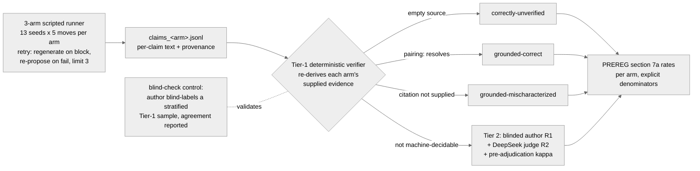

# Milestone 02 — S6/S7/S8 Implementation Plan

> **For agentic workers:** REQUIRED SUB-SKILL: Use superpowers:subagent-driven-development (recommended) or superpowers:executing-plans to implement this plan task-by-task. Steps use checkbox (`- [ ]`) syntax for tracking.

**Goal:** Fill the README Results section from the landed S5 data (562 claims, all Tier-1), ship the showcase media wave, and publish the repo.

> **Amended 2026-07-10 (discussion gate, user-approved):** Task 4 findings gain an explicit H1 verdict; Task 4's H2 slot ships as an honest placeholder in S6; Task 5 is resequenced after Task 10 (off S6's critical path); Task 6 Step 3 adds milestone integration note (i) — 03 inherits bench-12.

**Architecture:** S6 is analysis + writeup over already-landed artifacts in `eval/out/` (gitignored — never regenerate; a re-run re-spends and re-rolls). S7 produces media into `docs/media/` with the existing `web/tools` rig + vhs/mermaid-cli. S8 merges to master and pushes (D7's one public debut). No new Go code except where a task says so; instruments stay frozen at `32afe54`.

**Tech Stack:** Go 1.26 CLI (`cmd/eval`), Mermaid, vhs (or asciinema+agg fallback), mermaid-cli (`mmdc`), ffmpeg, `gh` CLI, existing `web/tools/demo.mjs` headless rig.

## Global Constraints

- **PREREGISTRATION.md is USER-PASTE ONLY.** No task edits it. No amendment is expected in S6–S8.
- **Instruments frozen at `32afe54`** (7 paths, §9 T1 re-pin). Any edit to them = stop, new user gate.
- **`eval/out/` artifacts are the counted data.** Never re-run `eval run --live`. Backups: `eval/out/live-backup-2026-07-09/`.
- **D7:** no `git push` until S8. All work on `measure-run` branch.
- **§8 honesty rules:** κ has no rows (zero Tier-2) — report that plainly; H2 reported with explicit N whatever it is; no bare percentages without denominators; nothing dressed up.
- **The landed numbers (source of truth for every table):** ungrounded 150 / flavorgraph 203 / grounded 209 claims; 12/13 seeds per arm (bench-12 skipped, `allergen-unresolved`, symmetric); labels: u 150 correctly-unverified; f 193 c-u + 10 grounded-correct; g 199 c-u + 10 grounded-correct; §7a rates all arms: provenance 1.000, mischaracterization 0.000, hallucination 0.000 (checkable = 150/203/209, excluded 0, unlabeled 0); spend $0.87.
- Author-hours steps are marked **[AUTHOR]** — Claude prepares, the author executes, Claude verifies.

---

## S6 — Results, findings, diagram, H2 fold

### Task 1: Blind-check control pass (verifier↔author agreement)

**Files:**
- Read: `eval/out/blind_check.csv` (18 rows, label_tier1 withheld), `eval/out/blind_check_map.csv` (SEALED until step 2 done), `eval/out/claims_all.jsonl`
- Modify: `docs/02-measure-run/log.md` (append one dated line)

**Interfaces:**
- Produces: the verifier↔author agreement figure + confusion matrix (stdout of `blind-check-score`) consumed verbatim by Task 4's Results text.

- [x] **Step 1 — superseded by §9 Amendment 3 (2026-07-10):** the sample was blind-labeled by an author-delegated LLM rater (fresh-context Claude agent, isolated worktree, blinded sheet + frozen rubric only); sheet integrity-verified against the sealed original; labels adopted by the author. Original instruction (record): author fills `label_r1` with one of the five frozen §7a categories, judging only `dish`/`text`/`source`, map sealed.
- [ ] **Step 2: Score it.**

```bash
go run ./cmd/eval blind-check-score --csv=eval/out/blind_check.csv \
  --map=eval/out/blind_check_map.csv --claims=eval/out/claims_all.jsonl
```

Expected: agreement rate + confusion matrix on stdout (sample is 18 rows, stratified per arm, seed 20260709). Copy the full output.
- [ ] **Step 3: Log it.** Append to `docs/02-measure-run/log.md`:
  `- **<date> — Tier-1 blind-check scored.** <agreement fraction> author↔verifier over 18 stratified rows; confusion: <paste>. Control for Amendment-1's Tier-1 machine labels.`
- [ ] **Step 4: Commit** `git add docs/02-measure-run/log.md && git commit -m "docs(02): S6 blind-check control scored"` (the CSVs are gitignored; the log line is the record).

### Task 2: Carried-notes triage (minors #2–#4 + Task-12/13 notes)

**Files:**
- Read: `.superpowers/sdd/progress.md`, `internal/eval/labels.go`, `internal/eval/rates.go:43-50`
- Modify: `docs/02-measure-run/log.md` (one dated triage line)

- [ ] **Step 1: Verify each carried note against the zero-Tier-2 reality and record the disposition in one log line:**
  - Task 13 note (adjudication must write author-final into `label_r1` before `rates`): **moot** — no Tier-2 rows exist, no adjudication happens; `FinalLabel()` (rates.go:46-49) reads `label_tier1` everywhere. State that in the log.
  - Task 6 note (restore "tiered labeling kit" in README): **already done** — `README.md:133` says "tiered labeling kit". Verify with `grep -n "tiered labeling kit" README.md` (expect one hit) and record.
  - Task 12 note (appended claims share one `*string` ref) + review minors #2–#4 (stub-only / S6-forward-dep / contrived): confirm none is live-data-affecting by re-reading the note text in progress.md; record "inspected, not applicable to live data" or open a fix task if one IS applicable (stop and ask the user in that case).
- [ ] **Step 2: Commit** `git commit -am "docs(02): S6 carried-notes triage"`.

### Task 3: Eval-pipeline Mermaid diagram (README + source for S7 SVG export)

**Files:**
- Modify: `README.md` — insert into the Architecture section after the "System data-flow" diagram (after the `</details>`/paragraph that closes it, around line 98; match the two existing diagrams' heading style `### ...`)

**Interfaces:**
- Produces: a `### The eval pipeline (tiered verification)` section whose Mermaid block S7 Task 3 exports to `docs/media/diagram-eval-pipeline.svg`.

- [ ] **Step 1: Insert this section** (adjust only the insertion point to sit cleanly after the data-flow diagram):

````markdown
### The eval pipeline (tiered verification)



*On the live campaign (2026-07-10) Tier-1 decided 562/562 claims — the Tier-2 path
(R1 sheet, judge, κ) had zero rows, machine-confirmed, and the blind-check control
is the only human labeling in the loop.*
````

- [ ] **Step 2: Render check.** Paste the block into https://mermaid.live or run `npx -y @mermaid-js/mermaid-cli -i /dev/stdin -o /tmp/check.svg` — expect a clean render, no syntax errors.
- [ ] **Step 3: Commit** `git commit -am "docs(readme): eval-pipeline diagram (3rd architecture diagram)"`.

### Task 4: Results section + findings + methodology reconciliation

**Files:**
- Modify: `README.md:148-188` (Methodology + Results sections)

**Interfaces:**
- Consumes: Task 1's agreement figure; the Global-Constraints landed numbers.
- Produces: the filled Results section S7's terminal capture and S8's publish gate point at.

- [ ] **Step 1: Fix the stale Methodology κ text.** Replace the `README.md:175-177` bullet ("**Reliability (κ) plan:** a second labeler double-labels 15–20% ...") with:

```markdown
- **Reliability plan (as amended):** PREREG §9 Amendment 1 replaced the second human
  labeler with tiered verification — a deterministic Tier-1 verifier (machine labels,
  validated by a blind-check control), plus a blinded author R1 pass and a DeepSeek
  judge R2 with pre-adjudication Cohen's κ over all Tier-2 claims. Amendment 2 added
  bounded move retries to the harness runner after live-model variance made the
  all-or-nothing arm design infeasible. Amendment 3 records that the blind-check pass
  was executed by an author-delegated LLM rater — its agreement figure is
  model-validates-machine, never human validation (full text + rationale for all three
  in [docs/PREREGISTRATION.md §9](docs/PREREGISTRATION.md)).
```

- [ ] **Step 2: Replace the Results placeholder** (`README.md:179-188`) with the real section. Use exactly the landed numbers; fill `<AGREEMENT>` from Task 1's output:

```markdown
## Results

Live 3-arm campaign, 2026-07-10 (13 ratified seeds × 5 moves × 3 arms, deepseek-v4-pro,
instruments frozen at PREREG §9's T1 re-pin; total model spend $0.87). Seeds completed:
**12/13 in every arm** — bench-12 (the tree-nuts stress seed) was blocked by the
deterministic allergen gate on all four generation attempts in all three arms
(`allergen-unresolved`; Amendment-2 skip, reported not silent).

### Provenance rates — PREREG §7a (per arm, checkable denominator)

| arm | claims | checkable | provenance | mischaracterization | hallucination |
|---|---|---|---|---|---|
| ungrounded | 150 | 150 | 1.000 | 0.000 | 0.000 |
| flavorgraph | 203 | 203 | 1.000 | 0.000 | 0.000 |
| grounded | 209 | 209 | 1.000 | 0.000 | 0.000 |

Label composition (the contrast the headline rates flatten): ungrounded emitted **zero
citations** (150× correctly-unverified); flavorgraph and grounded each emitted **10
`pairing:` citations, all resolving against their arm's supplied evidence**
(grounded-correct), the rest correctly-unverified. No claim in any arm fabricated or
mangled a citation.

### Labeling reliability

Tier-1 (deterministic verifier) decided **562/562 claims — the Tier-2 path had zero
rows**, so the pre-registered κ/confusion-matrix machinery had nothing to measure
(reported per §8: the frozen design met an unexpected data shape; nothing is imputed).
The blind-check control — an 18-row stratified Tier-1 sample blind-labeled by an
author-delegated LLM rater (fresh-context Claude agent, §9 Amendment 3;
model-validates-machine, cross-family vs the DeepSeek generator/judge) — agreed with
the verifier on **15/18 (83%)**. All three divergences were subjective flavor-harmony
claims the rater judged `opinion-non-checkable` where the mechanical empty-source rule
says `correctly-unverified` — the residual-risk shape Amendment 1's control watches
for, surfaced here as signal rather than error.

### Gate dynamics — H2

*Gate-dynamics telemetry is accumulating (single operator); this subsection is filled
from `eval replay` — explicit N, single-operator caveat — before publish (S8; Task 5,
resequenced).*

### Findings

The three §7a rates land at ceiling (1.000 / 0.000 / 0.000) in every arm: the live model
never fabricated a citation, and every uncited claim was correctly rendered
`[unverified]`. Rendered against the registration, **H1 is null on the registered
contrast** — grounded showed no provenance or hallucination advantage over ungrounded —
and the null is a ceiling effect, not a quality result: the ungrounded arm never
*attempted* a citation, so there was no fabrication for grounding to prevent, and §8's
deterministic-path-first attribution rule goes unused (there is no gap to attribute).
Nor does the ceiling show the arms are equally good: it shows the registered instrument
(provenance rates over the checkable denominator) cannot separate arms when citation
uptake is 0–5%. The arms instead separate on **citation uptake**, which was low
everywhere (10/209 grounded, 10/203 flavorgraph, 0/150 ungrounded): grounding evidence
changed *whether* the model cites (ungrounded cited nothing; both evidence-fed arms
cited, always correctly) but not how often it grounds a claim. Tier-1's 100% coverage —
a consequence of provenance vocabulary staying within `pairing:`/empty — collapsed the
planned human-labeling campaign to the 18-row control. These are descriptive results
over one model, one seed set, and a single-operator telemetry stream; they are not
user-research or quality claims (§8).
```

- [ ] **Step 2b (added by Amendment 3): Fix the eval-pipeline diagram's stale rater claims.** In the diagram shipped by Task 3: (i) the `BC` node text "blind-check control:<br/>author blind-labels a stratified<br/>Tier-1 sample, agreement reported" → "blind-check control:<br/>author-delegated LLM rater<br/>blind-labels a stratified Tier-1<br/>sample (§9 Amendment 3)"; (ii) in the caption below the block, "and the blind-check control is the only human labeling in the loop" → "and the blind-check control — run by an author-delegated LLM rater (§9 Amendment 3) — is the only labeling outside the deterministic verifier". The `T2` node ("blinded author R1 + DeepSeek judge R2") stays — Amendment 3 is blind-check-only, Tier-2 R1 remains the author.
- [ ] **Step 3: Cross-check every number** against `go run ./cmd/eval rates --labels=eval/out/claims_judged.jsonl` output — the table must match to the digit.
- [ ] **Step 4: Commit** `git commit -am "docs(readme): Results filled from the live campaign; methodology reconciled to §9 amendments"`.

### Task 5: H2 operator sessions + gate-dynamics fold

> **RESEQUENCED (2026-07-10 discussion gate):** executes after Task 10 and before
> Task 11 — off S6's critical path. S6 ships (Task 6) without it; the author
> accumulates sessions during S7; S8's publish gates on the user's call at the honest
> N then available (~8 target). Note: operator sessions spend live API budget
> ($1.13 headroom under the $2 cap).

**Files:**
- Modify: `README.md` (the H2 placeholder from Task 4), `docs/02-measure-run/log.md`

- [ ] **Step 1 [AUTHOR, elapsed-time]: Real operator sessions.** Use the workbench for real dishes (`make run`, the web UI) — spec floor ~8 sessions. Current count is **0** (verified 2026-07-10). These accumulate in `./data/capycook.db` with `run_kind=operator`.
- [ ] **Step 2: Fold.** `go run ./cmd/eval replay` — replace Task 4's README H2 placeholder with the emitted markdown table + caveat verbatim. If N is still thin at execution time, it ships with its honest N per §8 — never wait indefinitely; the user decides when to stop accumulating.
- [ ] **Step 3: Log + commit** `git commit -am "docs(readme): H2 gate-dynamics fold, N=<n>"`.

### Task 6: S6 ship ritual

- [ ] **Step 1:** `make test && make vet` green; `git diff 32afe54..HEAD -- internal/llm/prompts eval/fixtures/seeds.json internal/eval/runner.go data/safety eval/fixtures/move_script.json internal/llm/evidence.go internal/eval/mapping.go` → empty.
- [ ] **Step 2:** Fresh-context review of the S6 README diff (reviewer gets: the diff, the landed numbers from Global Constraints, §8's honesty rules; verdict SHIP required).
- [ ] **Step 3:** milestone.md: S6 → shipped, S7 → next, **append integration note (i): milestone 03 inherits bench-12 — extend allergen-resolver coverage or re-author the seed via a new ratification gate**; handoff.md overwritten; one log line. Commit.

---

## S7 — Media wave

### Task 7: Four new workbench GIFs

**Files:**
- Create: `docs/media/05-branch-compare-promote.gif`, `docs/media/06-autonomy-dial.gif`, `docs/media/07-midstream-cancel.gif`, `docs/media/08-technical-dark.gif`
- Read: `web/tools/README.md`, `web/tools/demo.mjs` (the existing headless capture rig that produced GIFs 01–04)

- [ ] **Step 1:** Read `web/tools/README.md` and reproduce the rig's invocation for one existing GIF to confirm it still runs (stub server, `CAPYCOOK_STUB_LLM` path — no live spend).
- [ ] **Step 2–5:** One scenario per GIF, spec Part 4 list: ① branch → compare → promote ② autonomy dial (deterministic fast-forward, creative still gates) ③ mid-stream cancel ④ technical view + dark mode. Constraints: ≤15s, 640–800px wide, 15fps, <5MB each (verify with `ls -la` + `gifsicle --info` if available).
- [ ] **Step 6:** Embed all four in README's Demo section alongside GIFs 01–04; commit per GIF or as one commit.

### Task 8: Eval terminal capture

**Files:**
- Create: `docs/media/09-eval-run.gif`
- Read: `eval/out/live-backup-2026-07-09/run_grounded_live.log` (the real campaign output)

- [ ] **Step 1:** Install vhs (`brew install vhs`) or fall back to asciinema+agg. Write a `.tape` that replays the REAL grounded-arm log tail (budget banner → telemetry-enabled → arm summary → SKIPPED line → tier-1 coverage) via `cat` with realistic pacing — never a fabricated transcript.
- [ ] **Step 2:** Render, check <5MB/≤15s, embed above the Results section, commit.

### Task 9: Diagram SVG exports + Langfuse screenshot

**Files:**
- Create: `docs/media/diagram-state-machine.svg`, `docs/media/diagram-data-flow.svg`, `docs/media/diagram-eval-pipeline.svg`, `docs/media/langfuse-trace.png`

- [ ] **Step 1:** Extract each README Mermaid block to a temp file; `npx -y @mermaid-js/mermaid-cli -i <tmp>.mmd -o docs/media/<name>.svg` (add `prefers-color-scheme` styling per spec).
- [ ] **Step 2 [AUTHOR-assisted]:** Langfuse UI → the 2026-07-10 `llm.generate_move` campaign traces → screenshot one trace detail → `docs/media/langfuse-trace.png`; embed in README's telemetry/methodology area with a caption naming the campaign date. **Redact/crop any project id or key material before commit.**
- [ ] **Step 3:** Commit.

### Task 10: Hero banner + social preview + portfolio MP4s

**Files:**
- Create: `docs/media/hero.png`, `docs/media/social-preview.png` (1280×640), `docs/media/mp4/*.mp4`

- [ ] **Step 1:** Compose hero + social preview from the 02a evidence shots (`docs/archive/02a-frontend-redesign/` assets) — hero at README top, social preview kept for S8's settings pass.
- [ ] **Step 2:** `for f in docs/media/0*.gif; do ffmpeg -i "$f" -movflags faststart -pix_fmt yuv420p docs/media/mp4/$(basename "${f%.gif}").mp4; done`
- [ ] **Step 3:** README order audit against spec Part 4 (hero+badges → GIFs → diagrams → how-it-works → methodology → results → quickstart → positioning → safety → docs). Commit.
- [ ] **Step 4:** S7 ship ritual (review of rendered README on a GitHub-flavored previewer; milestone/handoff/log; commit).

---

## S8 — Publish

### Task 11: Merge + push (D7 gate — USER confirms)

- [ ] **Step 1:** Exit-criteria audit against `docs/02-measure-run/milestone.md` — every box checked with evidence, including "no API key in any public artifact": `git grep -iE "sk-[a-zA-Z0-9]|LANGFUSE_SECRET|DEEPSEEK_API_KEY=" -- ':!.env.example'` → only doc references, no values.
- [ ] **Step 2 [USER gate]:** Merge `measure-run` → `master` (no-ff), then `git push origin master` — the one public debut. User says go.
- [ ] **Step 3:** Tag: `git tag -a v0.2-measure-run -m "milestone 02: measured run" && git push --tags`.

### Task 12: GitHub settings pass + portfolio linkage

- [ ] **Step 1:** `gh repo edit --description "..." --add-topic ...` (description: one-line stack + eval claim; topics: golang, react, llm, evaluation, preregistration, food); upload `docs/media/social-preview.png` via Settings → Social preview (manual — gh has no API for it); pin the repo; verify repo-name casing vs clone URL.
- [ ] **Step 2:** Verify all 8 GIFs + 3 SVGs render on the live GitHub README (fresh browser, dark AND light).
- [ ] **Step 3 [AUTHOR]:** Portfolio site: embed the MP4s + repo link.
- [ ] **Step 4:** Milestone ship ritual: milestone.md → shipped; `docs/milestones.md` → 02 shipped, 03 `← active`; final handoff; archive note. Commit + push.

---

## Self-review (done at write time)

- Spec coverage: S6 row (R1 labeling → vacuous, documented in Results; κ → no-rows reported; adjudication → moot, triaged in Task 2; rates/Results/findings → Task 4; eval-pipeline diagram → Task 3; H2 fold → Task 5) ✓; S7 row (4 GIFs T7, terminal capture T8, hero/social T10, SVG T9, MP4s T10) ✓; S8 row (push T11, settings T12, portfolio T12) ✓.
- No placeholders except runtime-produced figures (`<AGREEMENT>`, H2 table, N) — each has the exact command that produces it.
- Numbers cross-checked against the live `rates` output 2026-07-10.
